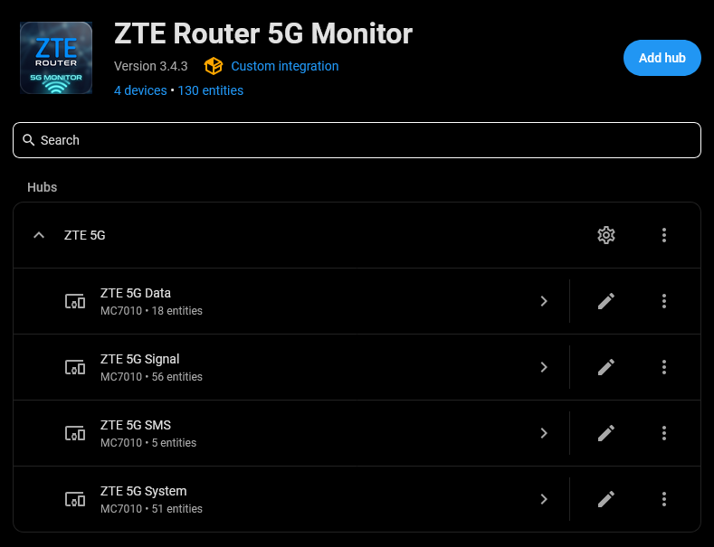
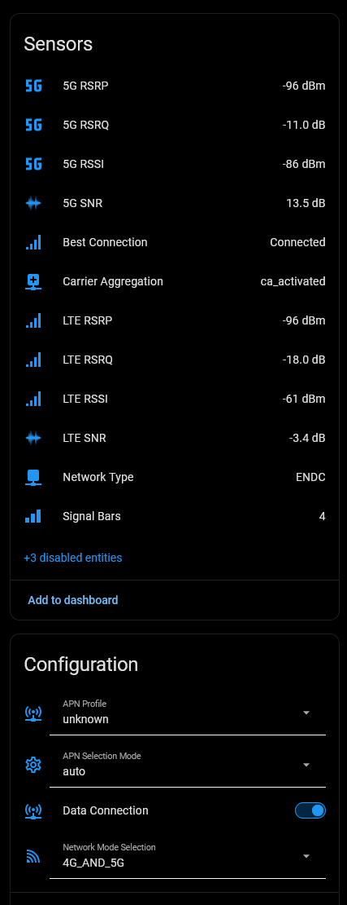
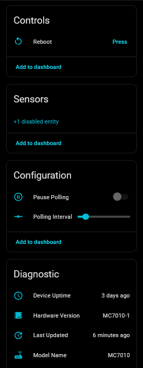
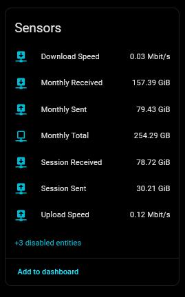
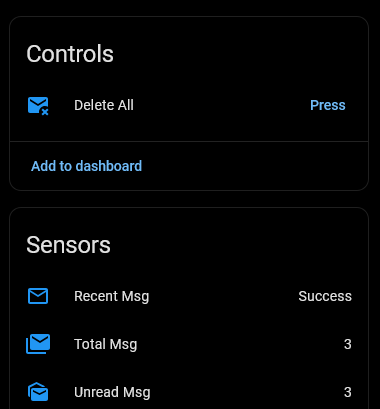
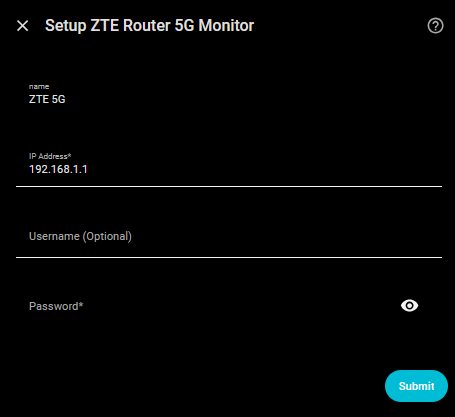

# ZTE Router 5G Monitor for Home Assistant

[](https://hacs.xyz/) [](https://hacs.xyz/docs/faq/custom_repositories) [](https://github.com/PlayFaster/ha-zte-router-5g-monitor/releases) [](https://opensource.org/licenses/Apache-2.0) [](https://github.com/PlayFaster/ha-zte-router-5g-monitor/actions/workflows/validate.yaml)  [](https://github.com/PlayFaster/ha-zte-router-5g-monitor/commits/main)

A Home Assistant integration for **ZTE 5G CPE Routers** providing Signal Stats, Data Usage & SMS Management.

> [!NOTE]
>
> **Is this the right integration for you?**
>
> - **If you own a ZTE MC7010** and want to monitor your 5G/LTE connection quality, data usage, and manage SMS messages directly from Home Assistant, then **yes**.
> - **This integration is for you if** you want:
>   - **Advanced Signal Diagnostics** — Real-time tracking of RSRP, RSRQ, RSSI, and SNR for both LTE and 5G.
>   - **Polling Control** — Pause polling and adjust the scan interval dynamically from the HA UI or via automation.
>   - **SMS Management** — View recent message content and delete the mailbox directly from HA.
>
> This project is optimized for the ZTE MC7010 5G Outdoor CPE but may work with other similar ZTE devices.

## 🔧 Compatibility & Requirements

**Router Hardware:**

- **Tested on**: **ZTE MC7010** – 5G Outdoor CPE.
- **Expected compatible**: Other ZTE 5G CPE devices (e.g., MC801A) may work but are currently untested.
- **Not Supported**: Non-ZTE hardware.

**Network:**

- Local network access to the router is required.

**Home Assistant Version:**

- Minimum: Home Assistant **2024.6.0**

---

## ✅ Features

### 📡 Advanced 5G/LTE Diagnostics

- **Detailed Signal Metrics**: RSRP, RSRQ, RSSI, and SNR for both the 5G NR and the LTE anchor cell.
- **Cell Tower Info**: Monitor Cell ID, eNodeB ID, PCI, and active frequency bands/channels.
- **Connection Type**: Track Carrier Aggregation and ENDC status plus LTE and 5G bands in use.

### 📊 Comprehensive Monitoring

- **Sub-Device Organization**: Entities are automatically grouped into four logical devices: **System**, **Signal**, **Data**, and **SMS**.
  - **System**: Core router info (Firmware, IMEI, Hardware Version), WAN/LAN IPs and uptime.
  - **Signal**: Extensive 5G NR and LTE signal data including RSRP, RSRQ, SNR, cell ID, and band info.
  - **Data**: Real-time upload/download speeds, monthly totals, and session-based counters.
  - **SMS**: Unread and total message count, the content of the most recent message and a Delete All button.

### 📋 Essential Router Management

- **Router Management**: Reboot the device directly from the HA UI.
- **SMS Management**: View recent messages and a "Delete All" button to clear the mailbox.
- **100% Local**: No cloud account or internet access required.

---

### 💡 Useful Features

- **Pause Polling**: Switch to halt polling when you need uninterrupted access to the router's web UI (ZTE only allows a single active login session).
- **Configurable Update Interval**: Dynamically adjust the scan interval (30s to 1 hour) via a number entity or automation.

> [!TIP]
>
> **Polling Interval can be controlled dynamically, via automation**
>
> - Polling Interval is available as a number control within the device, you can change it via automation, if desired.
> - Set it to 30 seconds during periods of heavy use to examine connection quality and set it higher afterwards, to avoid taxing the router and your Home Assistant database.

---

## 🏗️ Under the Hood

- **Resilient Polling**: Includes a hybrid retry logic (30s retry) and stale-data grace periods to prevent "Unavailable" flickers during router reboots.
- **Data Validation**: Router values are checked for validity (guard limits), with out-of-range sensors being marked as unknown.
- **Identity Strategy**: Uses the hardware IMEI as the unique identifier for stable entity tracking across reboots and IP changes.

---

## 📊 What You Get

This integration provides **63 entities** grouped into four logical devices: **System**, **Signal**, **Data**, and **SMS**.

| Type         | Count | Primary Functions                                             |
| :----------- | :---- | :------------------------------------------------------------ |
| **Sensors**  | 59    | Signal strength, data usage, uptime, SMS content, device info |
| **Switches** | 1     | Pause Polling                                                 |
| **Buttons**  | 2     | Reboot, Delete All SMS                                        |
| **Controls** | 1     | Polling Interval                                              |

---

## 💡 Example Automations

### Forward Incoming SMS to Mobile

This automation fires when a new SMS is detected and forwards the content to your mobile phone.

```yaml
alias: "ZTE: Forward SMS to Mobile"
triggers:
  - trigger: state
    entity_id: sensor.zte_5g_sms_recent_msg
actions:
  - action: notify.mobile_app_your_phone
    data:
      title: "New SMS from {{ state_attr('sensor.zte_router_5g_recent_msg', 'number') }}"
      message: "{{ states('sensor.zte_router_5g_recent_msg') }}"
```

### Data Usage Alert

Monitor your data consumption and get notified when you approach your monthly limit. If you change the display unit of data sensors (e.g. from Bytes to GB), you have to change the numbers below as well.

```yaml
alias: "ZTE: High Data Usage Alert"
triggers:
  - trigger: numeric_state
    entity_id: sensor.zte_5g_data_monthly_total
    above: 500000000000 # 500 GB (in bytes)
actions:
  - action: notify.mobile_app_your_phone
    data:
      title: "ZTE Data Alert"
      message: "Monthly data usage has exceeded 500GB."
```

### Signal Quality Alert

Monitor for poor connection quality based on 5G status and signal metrics.

```yaml
alias: "Signal: Poor Quality Connection Alert"
triggers:
  - platform: state
    entity_id:
      - binary_sensor.zte_5g_signal_best_connection
    to: "off"
    for: "00:05:00"
  - platform: state
    entity_id:
      - sensor.zte_5g_signal_network_type
    not_to: "ENDC"
    for: "00:05:00"
  - platform: state
    entity_id:
      - sensor.zte_5g_signal_carrier_aggregation
    not_to: "ca_activated"
    for: "00:05:00"
  - platform: numeric_state
    entity_id:
      - sensor.zte_5g_signal_signal_bars
    below: 4
    for: "00:05:00"
conditions:
  - condition: or
    conditions:
      - condition: numeric_state
        entity_id: sensor.zte_5g_signal_signal_bars
        below: 4
      - condition: state
        entity_id: binary_sensor.zte_5g_signal_best_connection
        state:
          - "off"
      - condition: not
        conditions:
          - condition: state
            entity_id: sensor.zte_5g_signal_carrier_aggregation
            state:
              - ca_activated
      - condition: not
        conditions:
          - condition: state
            entity_id: sensor.zte_5g_signal_network_type
            state:
              - ENDC
actions:
  - action: notify.mobile_app_your_phone
    data:
      title: "Poor Signal Quality Detected"
      message: |
        The router connection quality is poor.
        - 5G ENDC: {{ states('sensor.zte_5g_signal_network_type') }}
        - Best Connection: {{ states('binary_sensor.zte_5g_signal_best_connection') }}
        - Signal Bars: {{ states('sensor.zte_5g_signal_signal_bars') }}
        - CA: {{ states('sensor.zte_5g_signal_carrier_aggregation') }}
```

---

## 📸 Screenshots

### Integration Overview



| Signal | System |
| :-: | :-: |
|  |  |

| Data | SMS |
| :-: | :-: |
|  |  |

### Setup



---

## ✨ Installation

### HACS (Recommended)

1. Add this repository as a **Custom Repository** in HACS:
   - Open HACS in Home Assistant
   - Click **Custom repositories** (⋮ menu)
   - Add repository URL and Type: `Integration`
2. Search for "ZTE Router 5G Monitor" and click **Download**
3. Restart Home Assistant
4. Go to **Settings > Devices & Services > Add Integration** and search for "ZTE Router 5G Monitor"

### Manual Installation

1. Download the repository
2. Copy the `custom_components/zte_router_5g` folder to your Home Assistant `custom_components` directory
3. Restart Home Assistant
4. Go to **Settings > Devices & Services > Add Integration** and search for "ZTE Router 5G Monitor"

---

## ⚙️ Configuration

### Initial Setup

Setup is handled entirely via the UI. You will need:

- **Host** — Router IP Address (e.g., 192.168.0.1)
- **Username** — Router login username (default: admin)
- **Password** — Admin password for the router web interface

### Runtime Options

After installation, open **Settings > Devices & Services > ZTE Router 5G Monitor > Configure** to adjust:

| Option | Default | Range | Description |
| --- | --- | --- | --- |
| Polling Interval | 180 s | 30–3600 s (step: 30 s) | How often the integration fetches data from the router. Lower values give more responsive updates but increase router load. |
| Host | – | – | Router IP address (change if the router's LAN IP changes). |
| Username | – | – | Router login username. |
| Password | – | – | Admin password (update if changed on the router). |

---

## ❓ FAQ & Troubleshooting

### **"Failed to connect to router" Error**

- Verify the IP address is correct.
- Confirm the username and password are correct (ZTE default is usually `admin`).
- Ensure the router is powered on and reachable from your Home Assistant instance.

### **Some sensors showing "Unknown"**

- Most sensors showing okay with some unknown **is expected behavior**.
  - The integration fetches everything it can from the router.
  - Not every metric is provided by every ISP or firmware version.
  - 5G NR sensors will show "Unknown" when the router is operating in LTE-only mode.

### **All sensors showing "Unavailable" or "Unknown"**

- This is normal during a router reboot or if the router is unreachable.
  - The integration will automatically recover once the connection is restored.
- If it does not recover, check if you can log into the web UI of the router.

### **Why can't I access the router web UI while this is connected?**

- ZTE routers typically only allow **one simultaneous login session**.
- Use the **Pause Polling** switch in Home Assistant to halt polling before you log into the web UI.
- Resume polling when done!

---

## 🗑️ Removal

To remove the integration from Home Assistant:

1. Go to **Settings > Devices & Services**.
2. Find the **ZTE Router 5G Monitor** card and click into it.
3. Click the **three dots** (⋮) next to the gear icon and select **Delete**.
4. Confirm deletion.

To fully uninstall (HACS):

1. Go to **HACS**.
2. Find **ZTE Router 5G Monitor** and click into it.
3. Click the **three dots** (⋮) at the top right and select **Remove**.
4. Restart Home Assistant.

## 📝 Maintenance Status

This is a **personal project**. Support and updates are provided on a **"best-effort"** basis only. While I use this integration daily and aim to keep it functional with the latest Home Assistant releases, I cannot guarantee immediate fixes for issues or compatibility with all router firmware versions.

## 🤝 Contributors & Acknowledgements

- 🙏 Special Thanks: This project is based on the original work done by @Kajkac on ZTE Routers. A big thanks for the heavy lifting!
- This project was developed with the assistance of AI to ensure code quality and adherence to best practices.

## 📄 License [](https://opensource.org/licenses/Apache-2.0)

This project is licensed under the Apache License, Version 2.0. See [LICENSE](LICENSE) for details.

---

**For issues, feature requests, or contributions, please visit the [GitHub repository](https://github.com/PlayFaster/ha-zte-router-5g-monitor).**
