<!-- markdownlint-disable MD033 -->

# ZTE Router 5G Monitor for Home Assistant

[](https://hacs.xyz/) [](https://hacs.xyz/docs/faq/custom_repositories) [](https://github.com/PlayFaster/ha-zte-router-5g-monitor/releases) [](https://opensource.org/licenses/Apache-2.0) [](https://github.com/PlayFaster/ha-zte-router-5g-monitor/actions/workflows/validate.yaml)  [](https://github.com/PlayFaster/ha-zte-router-5g-monitor/commits/main)

---


---

A Home Assistant integration for **ZTE 5G CPE Routers** providing Signal Stats, Data Usage & SMS Management.

> [!NOTE]
>
> **Is this the right integration for you?**
>
> - **If you have a ZTE 5G/LTE Router in the MC7010, MC801, MC888, MC889, MF266, MF286 or MF289 family** and want to monitor your 5G/LTE connection quality, data usage, and manage SMS messages directly from Home Assistant, then **yes**.
> - **This integration is for you if** you want:
>   - **Advanced Signal Diagnostics** — SNR, RSRP, RSRQ and RSSI for both LTE and 5G, refreshed as often as every 30 seconds.
>   - **Data Usage Monitoring** — Track data usage and projected usage per month or per bill, and set alerts for high use.
>   - **SMS Management** — View the most recently received message content and send SMS messages directly in HA.
>   - **Polling Control** — Pause polling and adjust the scan interval dynamically from the HA UI or via automation.
>
> This project is optimized for the ZTE MC7010 5G Outdoor CPE and designed to work with MC801, MC888, MC889, MF266, MF286, MF289 routers as well.

## 📋 Table of Contents

- [ZTE Router 5G Monitor for Home Assistant](#zte-router-5g-monitor-for-home-assistant)
  - [📋 Table of Contents](#-table-of-contents)
  - [🔧 Compatibility \& Tested Devices](#-compatibility--tested-devices)
  - [🎯 Use Cases](#-use-cases)
  - [✅ Features](#-features)
  - [🔍 What You Get](#-what-you-get)
  - [🔘 Controls \& Settings](#-controls--settings)
  - [💬 SMS Actions](#-sms-actions)
  - [💡 Example Automations](#-example-automations)
  - [📥 Installation](#-installation)
  - [🔧 Configuration](#-configuration)
  - [🔩 Under the Hood - Technical Architecture](#-under-the-hood---technical-architecture)
  - [❓ FAQ \& Troubleshooting](#-faq--troubleshooting)
  - [❗ Known Limitations /❔ What's Missing?](#-known-limitations--whats-missing)
  - [❌ Removal](#-removal)
  - [📝 Maintenance Status](#-maintenance-status)
  - [🤝 Contributors \& Acknowledgements](#-contributors--acknowledgements)
  - [🔀 Other Options](#-other-options)
  - [📄 License](#-license)

## 🔧 Compatibility & Tested Devices

**📟 Router Hardware:**

- **Fully Tested**:
  - **ZTE MC7010** (5G Outdoor CPE) — tested on firmware `V1.0.0B01` and `V1.0.0B03`.
  - _This is currently the ONLY model verified on live hardware._

- **Expected Compatible (ZTE `goform` API Family)**:
  - Other ZTE 5G/4G CPE modems using the `goform` interface are expected to work, including:
    - **ZTE MC801 / MC801A** (Indoor 5G CPE)
    - **ZTE MC888 / MC888A / MC888 Ultra** (Indoor 5G Wi-Fi 6 CPE)
    - **ZTE MC889 / MC889A** (Outdoor 5G CPE)
    - **ZTE MF266 / MF286 / MF289** (LTE/4G Outdoor & Indoor CPEs)
  - _(Note: While protocol support for these model families is built into the integration, they remain unverified)._

- **Not Compatible (Incompatible Router Families)**:
  - ❌ **ZTE G5-Series Next-Gen Routers (G5TC, G5TS, G5C, G5 Max)** — These use ZTE's OpenWrt-based `/ubus/` JSON-RPC API instead of `goform`. Use **[`ha-zte-ng-router`](https://github.com/rosenrot00/ha-zte-ng-router)** instead.
  - ❌ **ZTE Landline Fiber ONTs / DSL Routers (F6640, F680, H288A, H388X, FIBRA6S/Livebox 6s, etc.)** — These use ZTE's `_type=` Lua/XML web interface and focus on LAN tracking rather than cellular metrics. Use **[`zte_tracker`](https://github.com/juacas/zte_tracker)** or **[`ha-zte-fibra`](https://github.com/AldenDana/ha-zte-fibra)** instead.
  - ❌ **Non-ZTE hardware.**

> [!NOTE]
>
> This is a 5G/LTE signal monitor, data use tracker and SMS client. It does not provide LAN/Wi-Fi client device tracking.

**🌐 Network:**

- Local network access to the router is required. No cloud account or internet access is needed.

**🏠 Home Assistant Version:**

- Minimum: Home Assistant **2024.8.0**
- Minimum Python: **3.12+** (this is built into and handled by HA, but relevant for non-standard installs).

## 🎯 Use Cases

- **Signal Monitoring**: Live and historical 5G/LTE signal data enable the monitoring of router performance. See [Reading Your Signal Data](#-reading-your-signal-data)
  - **Best Signal**: Use signal diagnostics (SNR, RSRP) to optimize the physical placement or orientation of your router. → [Morning Signal Report](#-morning-signal-report) example.
  - **Performance Tracking**: Use signal history to check whether the performance from your 5G/LTE ISP is stable or changing. → [Cell Tower Change Alert](#-cell-tower-change-alert) example.
  - **Connection Quality**: Know if your router has dropped to a lower-capability 4G/LTE only connection. → [Signal Quality Alert](#-signal-quality-alert) example.

- **Data Cap Management**: Create automations to get notified when your usage crosses a threshold you set (for example, as you approach your monthly data limit) to avoid unexpected overage charges on limited 5G plans. → [Data Usage Alert](#-data-usage-alert) example.

- **Unattended Recovery**: Fail over to a backup APN, or restart the router, when the connection stops recovering on its own. → [APN Failover](#-apn-failover--network-selection) and [Auto-Reboot on a Prolonged Outage](#-auto-reboot-on-a-prolonged-outage) examples.

- **Smart SMS Gateway**: Use your router as a notification bridge; for example, forward home security alerts to your mobile phone. → [Alert on Incoming SMS](#-alert-on-incoming-sms) example.
  - ❗**Obligatory Warning**: It is _**YOUR**_ responsibility to understand whether having your Router send SMS messages is going to incur an extra charge from your ISP.

## ✅ Features

### 📡 Advanced 5G/LTE Diagnostics

Track signal strength metrics (SNR, RSRP, RSRQ, RSSI), serving cell tower details, and active carrier bands — as often as every 30 seconds.

<details>

<summary>
&nbsp; &nbsp; ➕ &nbsp; &nbsp; Click to Expand for Details:
</summary><br>

- **Detailed Signal Metrics**: SNR, RSRP, RSRQ and RSSI for both the 5G NR and the LTE anchor cell tower.
- **Cell Tower Info**: Monitor Cell ID, eNodeB ID, PCI, and active frequency bands/channels. See the [Cell Tower Change Alert](#-cell-tower-change-alert) example.
- **Connection Type**: Track Carrier Aggregation and ENDC status plus LTE and 5G bands in use. See the [Signal Quality Alert](#-signal-quality-alert) example.

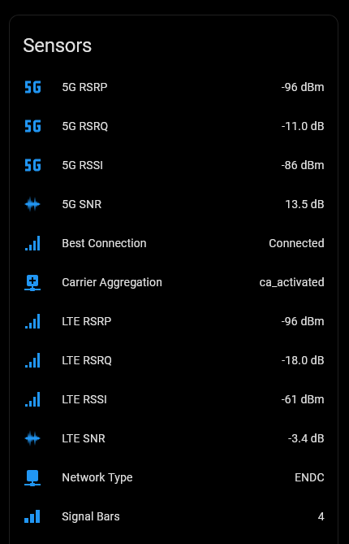

---

</details>

<br>

#### 📶 Reading Your Signal Data

This integration reports a lot of signal numbers. This section explains which ones matter, what to expect, and how to compare one antenna position against another.

<details>

<summary>
&nbsp; &nbsp; ➕ &nbsp; &nbsp; Click to Expand for Details:
</summary><br>

#### Start with two numbers

| Look at  | To answer                         | Entity                |
| :------- | :-------------------------------- | :-------------------- |
| **SNR**  | _How fast will this actually go?_ | `5G SNR`, `LTE SNR`   |
| **RSRP** | _Do I have coverage at all?_      | `5G RSRP`, `LTE RSRP` |

**SNR (Signal Quality) is the single most useful number.** It measures your signal against what competes with it, and it tracks achievable throughput more closely than anything else the router reports.

> **SNR and SINR** are related but separate metrics. **SNR** (Signal-to-Noise Ratio) measures the signal against background noise; **SINR** (Signal-to-Interference-plus-Noise Ratio) measures it against noise _plus_ interference from other transmitters. **This integration reports SNR**, as `LTE SNR` and `5G SNR`.

**RSRP (Signal Strength) is raw received power.** It tells you whether the tower is reaching you, not how well the connection will perform.

They move independently, and that is the point:

- **Strong RSRP, poor SNR** — you are close to a busy tower. Plenty of signal, but lots of interference. Speeds disappoint despite "full bars".
- **Weak RSRP, good SNR** — you are far out but the sector is quiet. Often perfectly usable, sometimes better than the first case.


#### What the numbers mean

| Metric         | Excellent | Good       | Fair        | Poor   |
| :------------- | :-------- | :--------- | :---------- | :----- |
| **SNR** (dB)   | > 20      | 13 to 20   | 0 to 13     | < 0    |
| **RSRP** (dBm) | > −80     | −80 to −90 | −90 to −100 | < −100 |
| **RSRQ** (dB)  | > −10     | −10 to −15 | −15 to −20  | < −20  |
| **RSSI** (dBm) | > −65     | −65 to −75 | −75 to −85  | < −85  |

RSRP, RSRQ and RSSI are negative — **closer to zero is stronger**.

---

| Acronym  | Means                              | Think Of                    | Answers                                         |
| :------- | :--------------------------------- | :-------------------------- | :---------------------------------------------- |
| **SNR**  | Signal-to-Noise Ratio              | **"Signal Quality"**        | _How fast will this actually go?_               |
| **RSRP** | Reference Signal Received Power    | **"Signal Strength"**       | _Do I have coverage at all?_                    |
| **RSRQ** | Reference Signal Received Quality  | **"Connection Congestion"** | _Is the channel congested/busy?_                |
| **RSSI** | Received Signal Strength Indicator | **"Total Power"**           | _How much raw RF energy is reaching the modem?_ |

---

> [!TIP]
>
> Every signal entity carries an **`about`** note explaining what it measures, and most also give these threshold bands. Click the entity → **⋮ menu → Details**.

#### Treat these as a starting point, not a verdict

The bands above are conventional and worth knowing, but **what counts as "good enough" is specific to you**. A reading that would be poor for someone 500m from a tower can be entirely fine at 4km on a quiet sector, because the two are limited by different things — interference in the first case, noise in the second.

So the more useful question is almost never _"is −95 dBm good?"_. It is:

- **Is this position better than that position?**
- **Is today worse than last week?**

Both are comparisons, and both need readings over time rather than the number on screen right now.

#### Establish your own baseline

When the connection is working well, note your SNR, RSRP and RSRQ. **That is your reference.** A later drop from 18 dB SNR to 6 dB tells you far more than any general table, because it is measured against your own site, your own antenna and your own cell tower.

#### Comparing over time (no code needed)

Individual readings jump around constantly, so a snapshot is a poor basis for a decision. Home Assistant can average for you:

1. **Settings → Devices & Services → Helpers → Create Helper**
2. Choose **Combine the state of several sensors** → **Statistics**
3. Pick an entity — **`5G SNR`** if `Network Type` shows you are on 5G, otherwise **`LTE SNR`**. The 5G entity reads `unknown` whenever no 5G carrier is attached, and a Statistics helper built on it would have nothing to average.
4. Set the characteristic to **Arithmetic mean** and the max age to **15 minutes**

You now have a smoothed value that is stable enough to compare. Create a second one for RSRP if you are aligning an antenna.

**To compare two antenna positions:** leave the router in position A for a few minutes, note the averaged value, move to position B, wait again, and compare. The averaging is what makes the comparison meaningful — raw readings vary enough to point at the wrong answer.

**To watch for degradation over time:** add the signal entities to a History card. Long-term statistics keep hourly min/max/mean for a year, so a slow decline is visible in a way it never is from the current reading.

#### Is there one number for overall quality?

Simple Answer - **No**

There is no standard formula for combining SNR, RSRP and RSRQ into a single score, because which of them limits _your_ connection depends on where you are. Any weighted average would score an interference-limited site and a noise-limited site as if they were the same problem, and get at least one of them wrong.

The two closest things already exist:

- **SNR** — the best single indicator of usable throughput.
- **`Signal Bars`** (0–5) — the router's own composite. Coarse and vendor-defined, but it is the manufacturer's own summary.

If you want one number on a dashboard, use SNR.

---

</details>

<br>

### 📉 Data Usage Tracking

Monitor monthly data consumption, active session totals, and real-time upload/download speeds.

<details>

<summary>
&nbsp; &nbsp; ➕ &nbsp; &nbsp; Click to Expand for Details:
</summary><br>

- **Monthly Data Usage**: Track your monthly download, upload and total data usage. See the [Data Usage Alert](#-data-usage-alert) example.
- **Session Usage**: Track your download and upload for this session (i.e. since last router restart).
- **Download & Upload Speed**: Track your upload and download speeds. Note: This is valid, but only at the instant data was fetched from the router.
- **Reset Day** (`sensor.zte_5g_data_reset_day`): The day of the month the router zeroes its counters. This is the router's own billing cycle and need not be the 1st - worth checking against your provider's bill.
- **Projected Cycle Usage** (`sensor.zte_5g_data_projected_cycle_usage`): An estimate of where you will finish the cycle at your current rate. See [Understanding the usage projection](#understanding-the-usage-projection) below.

|                        Data Sensors                         |                     Data Diagnostics                      |
| :---------------------------------------------------------: | :-------------------------------------------------------: |
|  | 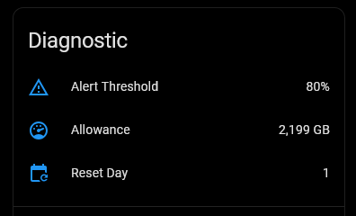 |

---

#### Understanding the usage projection

**Projected Cycle Usage** answers the question the monthly counters do not: _am I on course to stay within or exceed my allowance?_

It is a simple run-rate: usage period-to-date is divided by the days elapsed in the current cycle, and that rate is carried across the days remaining. Two things are worth knowing before you build an automation on it.

**It is least reliable at the start of a cycle, when it is likely to under-report.** Two days in, the sensor has only two days of evidence and 29 days to extrapolate across, so one large download distorts it.

| Attribute      | Meaning                                                                                                                                                           |
| :------------- | :---------------------------------------------------------------------------------------------------------------------------------------------------------------- |
| `confidence`   | `low`, `medium` or `high` — how much of the figure rests on observed usage rather than extrapolation. Reaches `high` around a quarter of the way through a cycle. |
| `basis`        | How the estimate was made. Currently always `run_rate_only`.                                                                                                      |
| `cycle_day`    | Where you are in the cycle, e.g. `12 of 31`.                                                                                                                      |
| `cycle_start`  | The date the current cycle began.                                                                                                                                 |
| `cycle_source` | `router` when the reset day came from the router, `calendar_assumed` when it did not report one and the 1st of the month was assumed.                             |

**On the first day of a cycle it reads low.** With only a few hours of usage to extrapolate from, the calculation clamps slightly, to avoid projecting unrealistically high totals. The effect is that the number starts low and climbs, settling on a more usable value once a full day has passed. It becomes more accurate from day 2 of every cycle (and day 2 after you first install the integration).

**It is not recorded in long-term statistics**, by design. It is an estimate of where you will finish, useful now rather than as a history — and the usage it derives from is already recorded by **Monthly Total**.

If you automate on it, gate the automation on `confidence` so you are not paged on day two:

```yaml
condition:
  - condition: template
    value_template: >
      {{ state_attr('sensor.zte_5g_data_projected_cycle_usage', 'confidence') != 'low' }}
```

**It follows the router's cycle, if set, and the calendar month** as default, if it is not set. The cycle boundary comes from **Reset Day**, so a cycle running the 15th to the 14th is handled correctly. Where the reset day is later than a short month allows — day 31 in February — the reset is taken as the last day of that month.

---

</details>

<br>

### 📋 Essential Router Management

Reboot router hardware directly from Home Assistant and monitor data integrity with automated self-diagnostics.

<details>

<summary>
&nbsp; &nbsp; ➕ &nbsp; &nbsp; Click to Expand for Details:
</summary><br>

- **Router Management**: Reboot the device directly from the HA UI, manually or from an automation. See the [Auto-Reboot on a Prolonged Outage](#-auto-reboot-on-a-prolonged-outage) example.
- **Self-Diagnosis**: An **Integration Health** binary sensor reports if the integration is experiencing issues, including data fetches that _succeeded_ but return nothing usable. See [Self-Diagnosis](#-self-diagnosis) and the [Integration Health Problem Alert](#-integration-health-problem-alert) example.

|                        System Control                        |                             System Diagnostics                             |
| :----------------------------------------------------------: | :------------------------------------------------------------------------: |
| 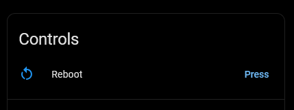 | 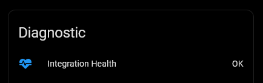 |

---

</details>

<br>

### 🔄 Dynamic Polling

This integration features **dynamic polling**, the ability to pause polling completely or to change the polling interval.

<details>

<summary>
&nbsp; &nbsp; ➕ &nbsp; &nbsp; Click to Expand for Details:
</summary><br>

- **Pause Polling**: Switch to halt polling when you need uninterrupted access to the router's web UI (ZTE only allows a single active login session). See the [Auto-Resume Polling](#-auto-resume-polling) example.
- **Configurable Update Interval**: Dynamically adjust the scan interval (30s to 1 hour, default 180s) via a number entity or automation. See the [Dynamic Polling Interval](#-dynamic-polling-interval) example.
- **Explicit Actions Always Fetch**: **Refresh Now**, a settings change or an SMS action fetches immediately **even while paused** — only scheduled polls are suppressed. See the [Morning Signal Report](#-morning-signal-report) example.
- **Standard System Option**: Also honours Home Assistant's **System options > Enable polling for changes** toggle.

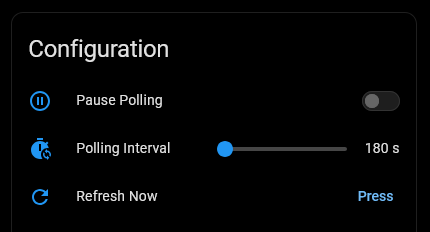

> [!TIP]
>
> **Polling Interval can be controlled dynamically, via automation**
>
> - Set it to 30 seconds during periods of heavy use, to examine connection quality or when you need to receive new SMS messages quickly, and set it higher afterwards, to avoid taxing the router and your Home Assistant database.

---

</details>

<br>

### 💬 SMS Management Actions

SMS count and text sensors, plus monitoring and control via events and actions. See [SMS Actions](#-sms-actions) and [SMS Examples](#-sms-examples)

## 🔍 What You Get

This integration provides **92 entities** (depending on your firmware) organized into four logical devices: **System**, **Signal**, **Data**, and **SMS**.

<details>

<summary>
&nbsp; &nbsp; ➕ &nbsp; &nbsp; Click to Expand for Details:
</summary><br>

| Sub-Device          | Entity Types (+disabled)                                            | Key Metrics                                                                                                           | Disabled by Default                                                                                                                                                                                                                                                                      |
| :------------------ | :------------------------------------------------------------------ | :-------------------------------------------------------------------------------------------------------------------- | :--------------------------------------------------------------------------------------------------------------------------------------------------------------------------------------------------------------------------------------------------------------------------------------- |
| ⚙️ **System**       | 22 Sensors, 6 Binary Sensors, 2 Switches, 2 Buttons, 1 Number (+21) | Firmware, IP Addresses, Uptime, **Integration Health**, Refresh Now, Reboot, Polling Controls                         | Uptime Duration, IMEI, Battery, SIM IMSI, SIM ICCID, the five temperature sensors, Time Server (SNTP), Router Timezone, WAN Operating Mode, WAN Fallback Mode, APN Interface Version, ODU LED Switch, Reboot Schedule, UPnP Enabled, SIP ALG Enabled, Web Page Sleep, Web Page Auto-Wake |
| 📶 **Signal**       | 36 Sensors, 1 Binary Sensor, 3 Selects (+10)                        | RSRP, RSRQ, SNR, PCI, Cell ID, Primary/Secondary Bands, APN Profile, APN Mode, Network Mode Selection                 | MDM MCC, MDM MNC, RMCC, RMNC, LTE Secondary Band & Bandwidth, Carrier Aggregation Secondary Cells, RSSI (legacy), RSCP (legacy), LTE Band Lock Mask                                                                                                                                      |
| 📈 **Data**         | 14 Sensors, 1 Switch (+4)                                           | Monthly Usage, **Projected Cycle Usage**, **Allowance**, **Reset Day**, **Alert Threshold**, Live Speed, Session Data | Monthly Upload/Download/Total (Legacy GB sensors), Data Limit Switch                                                                                                                                                                                                                     |
| ✉️ **SMS Entities** | 3 Sensors, 1 Button                                                 | Unread Count, Total Msg, Recent Msg, Delete All (one-click)                                                           | None                                                                                                                                                                                                                                                                                     |
| 🛠️ **SMS Actions**  | 4 Actions                                                           | Send, Delete, and List SMS                                                                                            | —                                                                                                                                                                                                                                                                                        |

---


---

> [!TIP]
>
> **Not sure what a sensor does?** Most entities carry a short built-in **About** note. Click the sensor to open it, use the **⋮ (three-dots) menu → Details**, and look for the **`about`** attribute - a one-line explanation of that sensor.
>
> 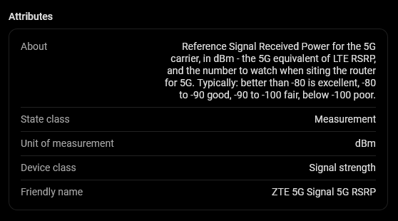
>
> That is where the acronyms are decoded: **RSRP**, **RSRQ**, **SNR**, **PCI**, **eNodeB**, **ENDC**, **APN** and the rest each explain themselves in place, so you do not have to look them up to read your own dashboard.
>
> These **About** notes - and all other attributes this integration publishes are set **unrecorded**. Home Assistant still shows them live in the entity's details, but **never writes them to the history/recorder database**. That keeps bulky or purely-informational values from bloating your database, with no downside to what you see day-to-day.

---

> [!NOTE]
>
> Entity Visibility: To keep your Home Assistant UI clean, some entities are disabled by default. You can enable them via the Entities tab in the device settings.

---

</details>

<br>

### 🧩 Tailoring What's Monitored

**Installed with its defaults, this integration needs no adjustment** - everything works out of the box. But it exposes a lot, and you may not want all of it. You have options.

<details>

<summary>
&nbsp; &nbsp; ➕ &nbsp; &nbsp; Click to Expand for Details:
</summary><br>

### 1. Do nothing (the easy option)

If you're simply not interested in some sensors, **you don't need to do anything - just ignore them.** The overhead is minimal (a disabled entity costs nothing; even an enabled one is just a row on a card). If in doubt, leave everything as-is.

### 2. Disable sensors or sub-devices (standard Home Assistant)

Use Home Assistant's built-in visibility controls - nothing specific to this integration:

- **One sensor:** click the entity → **⚙️ (settings)** → turn **Enabled** off.
- **A whole sub-device:** open its device page (e.g. _ZTE 5G Data_) → **⋮ menu → Disable device** - this disables every entity on that card at once.

Typical cases:

- If you never use the Router's SMS, you may not care about the **SMS** sensors.
- Not interested in data usage? You may not need the **Data** sub-device.
- Not monitoring **signal metrics**? You may have no use for the **Signal** sub-device. …and so on.

Disabled entities stay in the registry (greyed out) and can be re-enabled any time. This hides them from your UI; the integration still polls as normal.

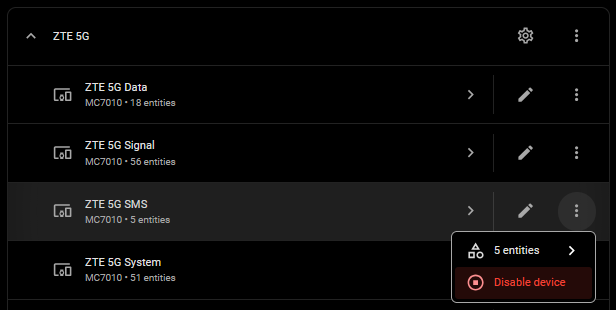

---

</details>

<br>

### 📊 Long Term Statistics (LTS)

Home Assistant records Long Term Statistics for numeric sensors that have a `state_class` set. This integration enables LTS only for sensors where long-term trend data is genuinely useful:

<details>

<summary>
&nbsp; &nbsp; ➕ &nbsp; &nbsp; Click to Expand for Details:
</summary><br>

| Sensors with LTS enabled                        | Why                                       |
| :---------------------------------------------- | :---------------------------------------- |
| LTE & 5G signal metrics (RSRP, RSRQ, RSSI, SNR) | Track connection quality trends over time |
| Monthly data usage (Sent, Received, Total)      | Monitor data consumption month-over-month |
| SMS counts (Unread, Total)                      | Track message volume over time            |
| Signal Bars                                     | Coarse signal summary over time           |

The following sensors have **no LTS** to avoid unnecessary database growth:

| Sensor                        | Reason                                                                          |
| :---------------------------- | :------------------------------------------------------------------------------ |
| Upload / Download Speed       | Instantaneous readings — history at poll intervals has limited analytical value |
| Session Sent / Received       | Resets on every reconnect — not meaningful for long-term trends                 |
| Uptime Duration               | Resets on reboot; predictable pattern adds no insight                           |
| Battery                       | Always 100% when plugged in                                                     |
| Legacy RSSI / RSCP (disabled) | Legacy metrics disabled by default                                              |
| **Projected Cycle Usage**     | An estimate of where the cycle ends up, useful now rather than as a history.    |
| **Reset Day**                 | A billing-cycle setting that changes infrequently                               |
| **Allowance**                 | A configured cap, not a measurement                                             |
| Alert Threshold               | Configuration setting; historical trend holds no analytical value               |

> [!TIP]
>
> **Want to add a sensor to Long Term Statistics?**
>
> Add a `state_class` override via [Manual Customization](https://www.home-assistant.io/integrations/homeassistant/#manual-customization) in your `configuration.yaml`. For example, to track Upload Speed in LTS:
>
> ```yaml
> homeassistant:
>   customize:
>     sensor.zte_5g_data_upload_speed:
>       state_class: measurement
> ```
>
> Restart Home Assistant after saving. The sensor will begin accumulating LTS from that point forward.
>
> The inverse is also true, setting `state_class: none` will remove a sensor from LTS. This is a legitimate tactic, if you want to see a sensors value for this week (default retention), but not for this year.
>
> If you want to see the current value, but have no interest in short or long term history, you can [exclude a value from the Recorder](https://www.home-assistant.io/integrations/recorder/#configure-filter).
>
> And of course, if a particular sensor, or group of sensors is of no interest to you, you can very easily disable it. See [What You Get](#-what-you-get) above. Remember you don't **need** to do **any** of this. These are _extra_ options for the Home Assistant user who wants _extra_ control.

---

</details>

<br>

## 🔘 Controls & Settings

Several settings are exposed as control entities so you can drive them from dashboards or automations, rather than reopening Configure:

- **Data Limit Switch** (`switch.zte_5g_data_data_limit_switch`, on the **Data** device, _disabled by default_): Turn the router's own data cap on or off. The cap itself, its units and the alert threshold are set on the router — see [Data Usage Tracking](#-data-usage-tracking).

### 🔧 Router Administration & Polling (System Device)

<details>

<summary>
&nbsp; &nbsp; ➕ &nbsp; &nbsp; Click to Expand for Details:
</summary><br>

- **Pause Polling** (`switch.zte_5g_system_pause_polling`): Halt all polling when you need exclusive access to the router's web UI.
- **Polling Interval** (`number.zte_5g_system_polling_interval`): Adjust the scan interval slider (30s to 1 hour, default `180` seconds).
- **Refresh Now** (`button.zte_5g_system_refresh_now`): Trigger an immediate refresh (data fetch).
- **Reboot** (`button.zte_5g_system_reboot`): Reboot the router hardware directly from Home Assistant.
- **ODU LED Switch** (`switch.zte_5g_system_odu_led_switch`, _disabled by default_): Turn the physical status LEDs of the outdoor unit on or off.

|                           System Configuration                            |                        System Control                        |
| :-----------------------------------------------------------------------: | :----------------------------------------------------------: |
| 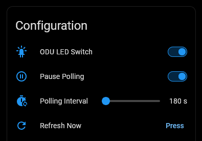 |  |

---

</details>

<br>

### 📡 APN & Network Settings (Signal Device)

<details>

<summary>
&nbsp; &nbsp; ➕ &nbsp; &nbsp; Click to Expand for Details:
</summary><br>

> [!WARNING]
>
> Switching APN can be an important and useful connectivity management tool. Bear in mind that your ISP may place restrictions on non-default APNs (reduced or no performance), so this is a proceed with caution and only if you know what you are doing area.

- **APN Profile** (`select.zte_5g_signal_apn_profile`): In Manual mode, switch the active APN profile.
- **APN Selection Mode** (`select.zte_5g_signal_apn_selection_mode`): Toggle between `auto` and `manual` APN mode.
- **Network Mode Selection** (`select.zte_5g_signal_network_mode_selection`): Select the preferred connection type. The values are the router's own, and its web page shows them under different names:

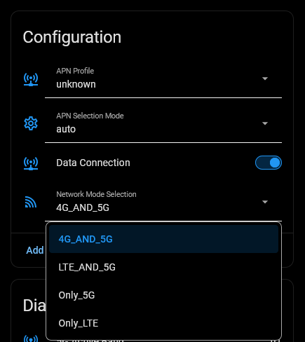

| Selector value | Router web page | Meaning                                               |
| :------------- | :-------------- | :---------------------------------------------------- |
| `4G_AND_5G`    | **Auto**        | Let the router choose, falling back as signal changes |
| `LTE_AND_5G`   | **5G NSA**      | 5G anchored to an LTE carrier                         |
| `Only_5G`      | **5G SA**       | 5G standalone, no LTE anchor                          |
| `Only_LTE`     | **4G Only**     | LTE only, 5G disabled                                 |

> [!WARNING]
>
> The two `Only_` values lock the radio. Where 5G coverage is marginal, `Only_5G` can drop the connection entirely and it may not recover on its own — prefer `4G_AND_5G` unless you are deliberately testing.
>
> This is a risk of dropping your WAN/internet connection. This integration will allow you to change the setting back, even if there is no connection, but NOT if you are accessing remotely (e.g. VPN) and depend on this connection for remote access.

#### **How APN selection behaves**

- **Choosing an APN Profile also switches the mode to Manual.** The router's command sets the profile and the mode together; there is no way to pick a profile without leaving auto. So the usual way to go manual is simply to choose the profile you want, not to change the mode first.

- **In Auto, the router uses the network's own default APN.** That default does not have to be one of your stored profiles, so the **APN Profile** selector may show unknown while you are perfectly well connected. Unknown there means "the APN in use is not one of your saved profiles" — not "no APN".

- **`sensor.zte_5g_signal_network_apn` is the authoritative value.** The APN Profile selector describes your stored _choice_; the **Network APN** sensor reports what the router is _actually connected with_. When the two disagree, believe the sensor. Use it in automations and templates rather than the selector.

- **The Default profile stores no APN.** Selecting it is a legitimate choice — the router's own page shows an empty APN field too — but because there is no value to report, **Network APN** reads `unknown` rather than a name. That is the profile working as intended, not a failed reading.

- **Profiles are created on the router, not here.** The integration selects among the profiles already stored on your router; it cannot add, edit or delete one — that is done on the router's own web page. A profile you add there appears in the **APN Profile** dropdown at the next poll, or immediately if you press **Refresh Now**. This integration lists up to ten APN Profiles.

- **Switching to Manual needs a profile to switch _to_.** The router refuses a mode change that does not name one, so if the APN currently in use is not among your saved profiles, choosing `manual` in **APN Selection Mode** reports an error asking you to pick from **APN Profile** instead. That is the route that works — it sets both at once.

---

</details>

<br>

### 📬 SMS Management Controls (SMS Device)

<details>

<summary>
&nbsp; &nbsp; ➕ &nbsp; &nbsp; Click to Expand for Details:
</summary><br>

- **Delete All** (`button.zte_5g_sms_delete_all`): One-click UI button to clear stored inbox messages (see [SMS Actions](#-sms-actions) for service options).

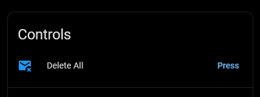

---

</details>

<br>

## 💬 SMS Actions

The SMS device has sensor entities that provide unread SMS count and latest message content plus a one-click **Delete All** button.

There is also an SMS received event and four SMS actions to send, read and delete SMS messages.

<details>

<summary>
&nbsp; &nbsp; ➕ &nbsp; &nbsp; Click to Expand for Details:
</summary><br>


- The `Recent Msg` sensor displays the most recent message received **OR** _sent_.
- In addition to the sensor entities, there is
  - A `zte_router_5g_sms_received` event for automation triggers ([example](#-alert-on-incoming-sms))
  - Four service actions for full programmatic control ([inbox cleanup](#-automated-inbox-maintenance) and [on-demand query](#-fetch-and-process-inbox-via-automation) examples).
- In the action examples below, the `entry_id:` of your router, where required, is drop-down menu selectable from the editor GUI.
- See [SMS Examples](#-sms-examples) for additional automation options.

### `zte_router_5g.send_sms`

<details>

<summary> &nbsp; &nbsp; Send an SMS message via the router.<br>
&nbsp; &nbsp; &nbsp; &nbsp; ➕ &nbsp; Click to Expand for Parameter Detail & YAML Example:
</summary><br>

| Parameter  | Required | Description                                                               |
| :--------- | :------- | :------------------------------------------------------------------------ |
| `entry_id` | No       | The router to use. Optional if only one router is configured.             |
| `target`   | **Yes**  | Recipient phone number(s) (e.g. `+1234567878`).                           |
| `message`  | **Yes**  | Message content. Length limit depends on the characters used - see below. |

> [!NOTE]
>
> **How long can a message be?**
>
> | Message contains                                               | Fits in one SMS | Maximum accepted |
> | :------------------------------------------------------------- | :-------------- | :--------------- |
> | Only standard characters (letters, digits, common punctuation) | **160**         | **765**          |
> | Any emoji, curly quote, or other special character             | **70**          | **335**          |
>
> A single special character changes the encoding for the **whole** message, which is why the second row is so much shorter. Longer messages are split into parts by the router and reassembled by the receiving phone, so they arrive as one message - but **your carrier charges for each part**. A 200-character plain-text alert is 2 parts; the same text with one emoji is 3.
>
> Going over the maximum is rejected with an error naming the limit that applied, rather than being silently cut short.

```yaml
action: zte_router_5g.send_sms
data:
  target: "+1234567878"
  message: "ZTE Router Test SMS Message"
```

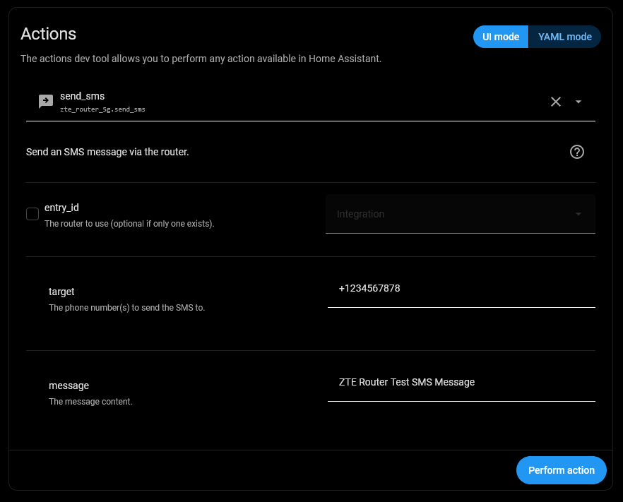

---

</details>

<br>

### `zte_router_5g.get_sms_list`

<details>

<summary> &nbsp; &nbsp; Fetch a list of SMS messages with action response support.<br>
&nbsp; &nbsp; &nbsp; &nbsp; ➕ &nbsp; Click to Expand for Parameter Detail & YAML Example:
</summary><br>

Fetch a list of SMS messages. Supports **Action Responses** — use the output directly in automations and scripts.

| Parameter  | Required | Default | Range     | Description                                                                               |
| :--------- | :------- | :------ | :-------- | :---------------------------------------------------------------------------------------- |
| `entry_id` | No       | —       | —         | The router to use. Defaults to your only router; required if more than one is configured. |
| `page`     | No       | `1`     | 1–100     | Page number for pagination.                                                               |
| `count`    | No       | `20`    | 1–50      | Messages per page.                                                                        |
| `box_type` | No       | `0`     | See below | Mailbox to read from. `0` reads every box.                                                |

**`box_type` values:** `0` All Boxes _(default)_ · `1` Local Inbox · `2` Local Sent · `3` Local Draft · `5` SIM Inbox · `6` SIM Sent · `7` SIM Draft · `8` Mix Inbox · `9` Mix Sent · `10` Mix Draft

**Response — each message in `messages`:**

| Field     | Type    | Description                                                  |
| :-------- | :------ | :----------------------------------------------------------- |
| `index`   | Integer | Storage index — pass to `delete_sms` to delete this message. |
| `phone`   | Text    | Sender's phone number.                                       |
| `content` | Text    | Message body.                                                |
| `date`    | Text    | Date/time string.                                            |
| `read`    | Boolean | `true` if read, `false` if unread.                           |

```yaml
action: zte_router_5g.get_sms_list
data:
  count: 20
  box_type: 1
response_variable: inbox
```

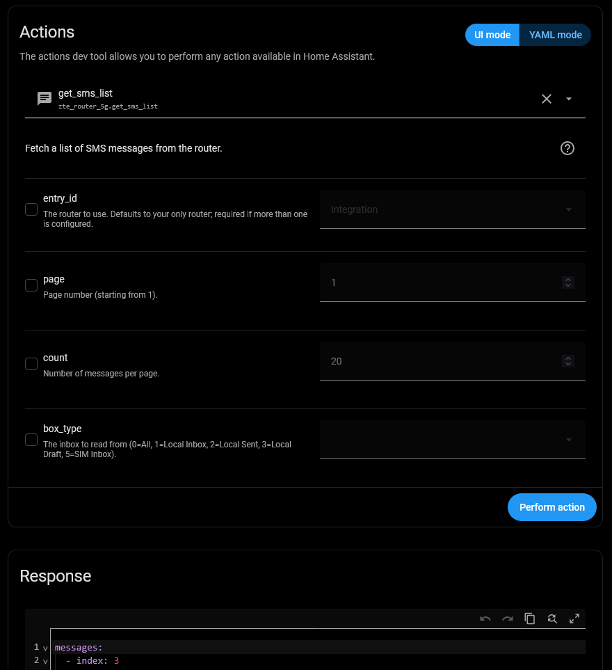

---

</details>

<br>

### `zte_router_5g.delete_sms`

<details>

<summary> &nbsp; &nbsp; Delete a single SMS by its storage index.<br>
&nbsp; &nbsp; &nbsp; &nbsp; ➕ &nbsp; Click to Expand for Parameter Detail & YAML Example:
</summary><br>

Delete a single SMS by its storage index. Use the `index` field from `get_sms_list` or from the `zte_router_5g_sms_received` event.

| Parameter  | Required | Description                                                                               |
| :--------- | :------- | :---------------------------------------------------------------------------------------- |
| `entry_id` | No       | The router to use. Defaults to your only router; required if more than one is configured. |
| `index`    | **Yes**  | Storage index of the message to delete (integer ≥ 0).                                     |

```yaml
action: zte_router_5g.delete_sms
data:
  index: 3
```

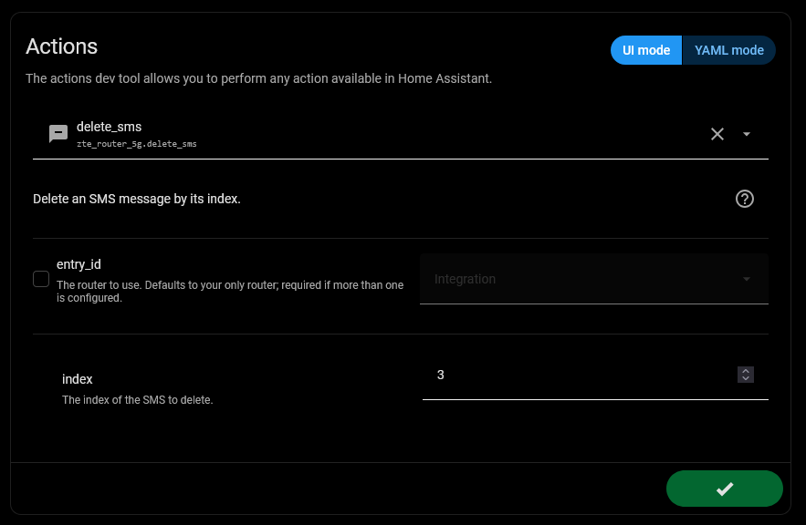

---

</details>

<br>

### `zte_router_5g.delete_all_sms`

<details>

<summary> &nbsp; &nbsp; Bulk delete SMS messages from the router inbox.<br>
&nbsp; &nbsp; &nbsp; &nbsp; ➕ &nbsp; Click to Expand for Parameter Detail & YAML Example:
</summary><br>

> The **Delete All** button entity is a simple one-click UI control with no parameters. The `delete_all_sms` service action below is the programmable equivalent and accepts a `keep_last` parameter to preserve recent messages.

| Parameter   | Required | Default | Range | Description                                                                               |
| :---------- | :------- | :------ | :---- | :---------------------------------------------------------------------------------------- |
| `entry_id`  | No       | —       | —     | The router to use. Defaults to your only router; required if more than one is configured. |
| `keep_last` | No       | `0`     | 0–50  | Number of most recent messages to preserve. `0` deletes all.                              |

```yaml
action: zte_router_5g.delete_all_sms
data:
  keep_last: 2
```

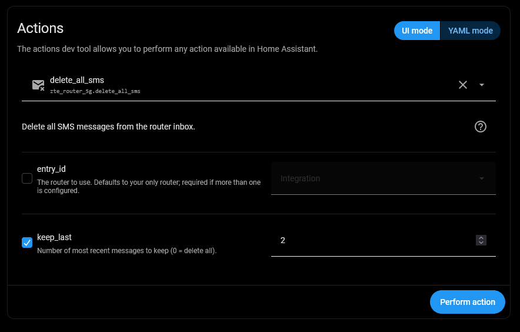

---

</details>

<br>

### `zte_router_5g_sms_received` Event

<details>

<summary> &nbsp; &nbsp; Event payload fields fired when a new incoming SMS is received.<br>
&nbsp; &nbsp; &nbsp; &nbsp; ➕ &nbsp; Click to Expand for Detail:
</summary><br>

Fires automatically when a new incoming SMS is detected. Use as an automation trigger.

| Field      | Type    | Description                                                               |
| :--------- | :------ | :------------------------------------------------------------------------ |
| `entry_id` | Text    | Config entry ID of the router that received the message.                  |
| `phone`    | Text    | Sender's phone number.                                                    |
| `content`  | Text    | Message body.                                                             |
| `date`     | Text    | Date/time of the message.                                                 |
| `index`    | Integer | Storage index — pass directly to `delete_sms` to delete after processing. |

See [Alert on incoming SMS](#-alert-on-incoming-sms) example.

</details>

---

</details>

<br>

## 💡 Example Automations

> [!NOTE]
>
> Entity IDs are derived from your gateway/sub-device names (e.g. `sensor.zte_5g_...`) and **may differ between installs**, or if you have renamed entities or devices. Use the entity picker in the Automation editor rather than copying the IDs below verbatim. The examples are illustrative.

---

> [!NOTE]
>
> The Automation examples below use the `note:` functionality introduced in Home Assistant 2026.6 as a way to document/comment Automations that is permanent and **not** stripped out by the editor. If using an older version of Home Assistant you may need to remove the `note:` sections.

---

> [!NOTE]
>
> Use your own preferred Automation notifier

<details>

<summary>&nbsp; &nbsp; &nbsp; &nbsp; ➕ &nbsp; Click to Expand for Notification Options:
</summary><br>

Replace

```yaml
action: persistent_notification.create
```

with

```yaml
action: notify.send_message
target:
  entity_id: notify.your_specific_phone
```

---

</details>

### 💬 SMS Examples

#### 📨 Alert on Incoming SMS

<details>

<summary> &nbsp; &nbsp; This automation fires when a new SMS is detected and generates a notification.<br>
&nbsp; &nbsp; &nbsp; &nbsp; ➕ &nbsp; Click to Expand for Automation Detail:
</summary><br>

```yaml
alias: "ZTE SMS: Alert on New SMS"
description: "Forwards the content of any newly received SMS to a notification"
mode: queued
max: 10
triggers:
  - trigger: event
    event_type: zte_router_5g_sms_received
    note: |
      Fires once per genuinely new message. Messages already on the router when Home
      Assistant starts are recorded silently as a baseline, so a restart never replays
      your whole inbox into this automation.
actions:
  - action: persistent_notification.create
    data:
      title: "New SMS from {{ trigger.event.data.phone }}"
      message: "{{ trigger.event.data.content }}"
    note: |
      The event payload carries phone, content, date and index. Use index with the
      delete_sms action if you want to remove the message after handling it.
```

> [!NOTE]
>
> `mode: queued` matters here — several messages can arrive in one poll cycle, and the default `single` mode would silently drop all but the first.

---

</details>

#### 🧹 Automated Inbox Maintenance

<details>

<summary> &nbsp; &nbsp; Keep your router's SMS storage clean by automatically deleting old messages while keeping the most recent ones for safety.<br>
&nbsp; &nbsp; &nbsp; &nbsp; ➕ &nbsp; Click to Expand for Automation Detail:
</summary><br>

```yaml
alias: "ZTE SMS: Weekly Inbox Cleanup"
description: "Deletes stored SMS weekly, keeping the five most recent"
mode: single
triggers:
  - trigger: time
    at: "03:00:00"
    note: Overnight, so the deletion never competes with a poll you are watching.
conditions:
  - condition: time
    weekday:
      - sun
    note: Weekly is usually enough; raise the frequency if your router fills up faster.
actions:
  - action: zte_router_5g.delete_all_sms
    data:
      keep_last: 5
    note: |
      keep_last preserves the newest N messages. Set it to 0 to clear the inbox
      entirely. The action refreshes the coordinator afterwards, so the SMS counters
      update immediately rather than at the next scheduled poll - and it does so even
      if Pause Polling is on.
```

---

</details>

#### 📜 Fetch and Process Inbox via Automation

<details>

<summary> &nbsp; &nbsp; Example of using the `get_sms_list` action response in an automation to count messages from a specific sender.<br>
&nbsp; &nbsp; &nbsp; &nbsp; ➕ &nbsp; Click to Expand for Automation Detail:
</summary><br>

```yaml
alias: "ZTE SMS: Count OTP Messages"
description: "Queries the inbox on demand and counts messages from one sender"
mode: single
triggers:
  - trigger: time
    at: "09:00:00"
    weekday:
      - mon
      - wed
      - fri
actions:
  - action: zte_router_5g.get_sms_list
    data:
      count: 50
    response_variable: inbox
    note: |
      This action performs its own fetch rather than reading the Recent Msg sensor, so
      it keeps working even if the SMS entities are disabled - and it returns the full
      message list, which is far too bulky to hold as a sensor attribute.
  - action: notify.persistent_notification
    data:
      message: |
        You have {{ inbox.messages | selectattr('phone', 'search', 'MY_BANK') |
        list | count }} messages from your bank in the inbox.
    note: |
      Each entry in inbox.messages has index, phone, content, date and read. Filter on
      any of them; use index to feed the delete_sms action.
```

---

</details>

### 📡 Connection, Data & Signal Automations

#### 📡 APN Failover & Network Selection

<details>

<summary> &nbsp; &nbsp; Automatically switch to a backup APN profile if the primary connection goes offline.<br>
&nbsp; &nbsp; &nbsp; &nbsp; ➕ &nbsp; Click to Expand for Automation Detail:
</summary><br>

> [!WARNING]
>
> Switching APN can be an important and useful connectivity management tool. Bear in mind that your ISP may place restrictions on non-default APNs (reduced or no performance), so this is a proceed with caution and only if you know what you are doing area.

```yaml
alias: "ZTE APN: Switch Profile on Network Failure"
description: "Switch to a backup APN profile if the primary WAN connection drops."
mode: single
triggers:
  - trigger: state
    entity_id: sensor.zte_5g_signal_wan_connect_status
    to: "disconnected"
    not_from:
      - "unknown"
      - "unavailable"
    for: "00:05:00"
    note: |
      The 5 minute hold matters. The integration already holds last-known values for
      three consecutive failed polls before reporting anything, so a value that has
      stayed "disconnected" for five minutes is a real outage rather than a blip.
      not_from suppresses transitions coming directly out of unknown or unavailable states.
conditions:
  - condition: state
    entity_id: select.zte_5g_signal_apn_profile
    state: "primary_apn"
    note: |
      Only fail over from the primary. Without this the automation would flap back and
      forth every time the backup APN also dropped.
actions:
  - action: select.select_option
    target:
      entity_id: select.zte_5g_signal_apn_profile
    data:
      option: "backup_apn"
    note: |
      Replace both profile names with values from your own router - the options come
      from the APN profiles it actually has configured. Selecting an option forces an
      immediate poll, so the change is reflected in Home Assistant right away.
```

---

</details>

#### 🚨 Data Usage Alert

<details>

<summary> &nbsp; &nbsp; Monitor your data consumption and get notified when you approach your monthly limit.<br>
&nbsp; &nbsp; &nbsp; &nbsp; ➕ &nbsp; Click to Expand for Automation Detail:
</summary><br>

The example below assumes the data sensors display in **GB**, which is the default. If you have changed the display units, adjust the thresholds and templates accordingly.

```yaml
alias: "ZTE Data: High Data Usage Alert"
description: "Warns once when monthly data crosses a threshold"
mode: single
triggers:
  - trigger: numeric_state
    entity_id: sensor.zte_5g_data_monthly_total
    above: 500
    note: |
      This assumes the data sensors display in GB which is the default.
      If you have changed the display units, adjust the threshold.
actions:
  - action: persistent_notification.create
    data:
      title: "ZTE Data Alert"
      message: |
        Monthly data usage has reached
        {{ states('sensor.zte_5g_data_monthly_total') | float(0) | round(0) }}
        {{ state_attr('sensor.zte_5g_data_monthly_total', 'unit_of_measurement') }}.
    note: |
      Reading the unit from the entity keeps the message correct whether you are
      displaying GB, MB or bytes. A numeric_state trigger fires only on the crossing,
      so this notifies once rather than on every poll above the threshold.
```

---

</details>

#### 🔮 Projected Overage Alert

<details>

<summary> &nbsp; &nbsp; Warn when you are <b>on course</b> to exceed your allowance, rather than waiting until you already have.<br>
&nbsp; &nbsp; &nbsp; &nbsp; ➕ &nbsp; Click to Expand for Automation Detail:
</summary><br>

Uses the data cap set on the router under Data Management. If you do not use this, change the "above:" setting to an actual number, say 1000 for 1TB.

```yaml
alias: "ZTE Data: Projected Overage Alert"
description: "Warns when the projection is set to exceed the allowance"
mode: single
triggers:
  - trigger: numeric_state
    entity_id: sensor.zte_5g_data_projected_cycle_usage
    above: sensor.zte_5g_data_allowance
    for:
      hours: 2
    note: |
      The threshold follows the router's own cap rather than a fixed number.
      The two-hour window rides out short swings in the projection.
conditions:
  - condition: template
    value_template: |
      {{ state_attr('sensor.zte_5g_data_projected_cycle_usage', 'confidence') != 'low' }}
    note: |
      Skips the first days of a cycle, when the projection is working from very
      little usage and swings widely.
actions:
  - action: persistent_notification.create
    data:
      title: "ZTE Data: projected to exceed allowance"
      message: |
        On current usage this cycle is projected to finish at {{ states('sensor.zte_5g_data_projected_cycle_usage') | float(0) | round(0) }} {{ state_attr('sensor.zte_5g_data_projected_cycle_usage', 'unit_of_measurement') }}
        - day {{ state_attr('sensor.zte_5g_data_projected_cycle_usage', 'cycle_day') }}, confidence {{ state_attr('sensor.zte_5g_data_projected_cycle_usage', 'confidence') }}.
    note: |
      Including the cycle day and confidence in the message tells you how much
      weight to give the warning without opening the entity.
```

---

</details>

#### 📶 Signal Quality Alert

<details>

<summary> &nbsp; &nbsp; Monitor for poor connection quality based on 5G status and signal metrics.<br>
&nbsp; &nbsp; &nbsp; &nbsp; ➕ &nbsp; Click to Expand for Automation Detail:
</summary><br>

```yaml
alias: "ZTE Signal: Poor Quality Connection Alert"
description: "Notifies when connection quality degrades on any of four measures"
mode: single
triggers:
  - trigger: state
    entity_id:
      - binary_sensor.zte_5g_signal_best_connection
    to: "off"
    from: "on"
    for: "00:05:00"
    note: |
      Best Connection is on only when the router has BOTH 5G ENDC and LTE carrier
      aggregation active.
  - trigger: state
    entity_id:
      - sensor.zte_5g_signal_network_type
    not_to:
      - "ENDC"
      - "unknown"
      - "unavailable"
    for: "00:05:00"
    note: |
      Dropped off 5G NSA entirely. Ignores unknown and unavailable states so reboots
      or transient polling failures do not trigger false alerts.
  - trigger: state
    entity_id:
      - sensor.zte_5g_signal_carrier_aggregation
    not_to:
      - "ca_activated"
      - "unknown"
      - "unavailable"
    for: "00:05:00"
    note: |
      Lost LTE carrier aggregation. Ignores unknown and unavailable states so reboots
      or transient polling failures do not trigger false alerts.
  - trigger: numeric_state
    entity_id:
      - sensor.zte_5g_signal_signal_bars
    below: 4
    for: "00:05:00"
    note: |
      Signal bars is the router's own 0-5 summary. Prefer RSRP or SNR if you want a
      physically meaningful threshold; bars is coarse but matches what the router's
      own UI shows.
conditions:
  - condition: template
    value_template: "{{ states('sensor.zte_5g_signal_network_type') not in ['unknown', 'unavailable'] }}"
    note: |
      Ensures the network state is valid before checking degradation conditions, preventing
      false evaluation when entities are temporarily unavailable.
  - condition: or
    conditions:
      - condition: numeric_state
        entity_id: sensor.zte_5g_signal_signal_bars
        below: 4
      - condition: state
        entity_id: binary_sensor.zte_5g_signal_best_connection
        state:
          - "off"
      - condition: not
        conditions:
          - condition: state
            entity_id: sensor.zte_5g_signal_carrier_aggregation
            state:
              - ca_activated
      - condition: not
        conditions:
          - condition: state
            entity_id: sensor.zte_5g_signal_network_type
            state:
              - ENDC
    note: |
      Re-checking the same four measures as conditions means the notification only
      fires if the degradation is still true when the action runs, not merely when
      one of them briefly flickered.
actions:
  - action: persistent_notification.create
    data:
      title: "Poor Signal Quality Detected"
      message: |
        The router connection quality is poor.
        - 5G ENDC: {{ states('sensor.zte_5g_signal_network_type') }}
        - Best Connection: {{ states('binary_sensor.zte_5g_signal_best_connection') }}
        - Signal Bars: {{ states('sensor.zte_5g_signal_signal_bars') }}
        - CA: {{ states('sensor.zte_5g_signal_carrier_aggregation') }}
    note: |
      Reporting all four values together tells you which one actually degraded, which
      is what you need to decide whether to reposition the router or just wait it out.
```

---

</details>

### 🩺 System Health & Connectivity Alerts

#### 🩺 Integration Health Problem Alert

<details>

<summary> &nbsp; &nbsp; Be told when the integration detects a fault in its own data.<br>
&nbsp; &nbsp; &nbsp; &nbsp; ➕ &nbsp; Click to Expand for Automation Detail:
</summary><br>

The **Integration Health** binary sensor turns on when the integration's self-checks find a problem — the router unreachable for several consecutive polls, an SMS endpoint that has stopped responding, or a poll that _succeeded_ but returned none of the fields the integration expects. It stays **available even when every other entity has gone unavailable**, so it can report the fault that made the others unreliable.

```yaml
alias: "ZTE Health: Integration Health Problem"
description: "Notifies when the integration's self-checks detect a problem"
mode: single
triggers:
  - trigger: state
    entity_id: binary_sensor.zte_5g_system_integration_health
    to: "on"
    for:
      minutes: 10
    note: |
      The 10 minute duration is deliberate. A brief outage can set the sensor and clear
      it on the next cycle; this reports only problems that persist. Shorten it if you
      would rather hear about transient faults too.
actions:
  - action: persistent_notification.create
    data:
      title: ZTE Router 5G Monitor needs attention
      message: |
        {{ state_attr('binary_sensor.zte_5g_system_integration_health', 'issues')
           | join(', ') }}
        Last good update: {{ state_attr('binary_sensor.zte_5g_system_integration_health', 'last_good_update') }}
    note: |
      issues is a list of human-readable problem descriptions. The sensor also carries
      severity (ok / degraded / warning / error), degraded_capabilities (names of failed
      endpoints), drift (contract-drift findings, empty unless the firmware appears to
      have changed its API), repairs (the repair issues currently raised), and
      consecutive_failures.
```

> [!TIP]
>
> To alert only on the serious cases and ignore ordinary connectivity blips, add a condition on the `severity` attribute: `{{ state_attr('binary_sensor.zte_5g_system_integration_health', 'severity') == 'warning' }}` fires only for a suspected firmware API change, which is the condition that also raises a Repair.

---

</details>

#### 🔄 Router Reboot Alert

<details>

<summary> &nbsp; &nbsp; Monitor and get alerted on router reboots.<br>
&nbsp; &nbsp; &nbsp; &nbsp; ➕ &nbsp; Click to Expand for Automation Detail:
</summary><br>

```yaml
alias: "ZTE Reboot: Router Reboot Alert"
description: "Notifies when the router's boot timestamp moves, indicating a restart"
mode: single
triggers:
  - trigger: state
    entity_id: sensor.zte_5g_system_device_uptime
    not_from:
      - unknown
      - unavailable
    not_to:
      - unknown
      - unavailable
    note: |
      Triggers after a reboot but avoids alerts due to availability glitches
actions:
  - action: persistent_notification.create
    data:
      title: "ZTE Router Rebooted"
      message: "The router has rebooted. Boot Time: {{ states('sensor.zte_5g_system_device_uptime') }}"
    note: Swap in notify.mobile_app_your_phone to get this on your phone instead.
```

---

</details>

#### 🔁 Auto-Reboot on a Prolonged Outage

<details>

<summary> &nbsp; &nbsp; Recover automatically from a stuck connection by restarting the router.<br>
&nbsp; &nbsp; &nbsp; &nbsp; ➕ &nbsp; Click to Expand for Automation Detail:
</summary><br>

> [!WARNING]
>
> This reboots your router unattended. Keep the trigger duration generous and `mode: single`, or a flapping connection can put the router into a reboot loop that stops it recovering on its own.

```yaml
alias: "ZTE Reboot: Auto-Reboot on Prolonged Outage"
description: "Reboots the router after a sustained WAN outage"
mode: single
max_exceeded: silent
triggers:
  - trigger: state
    entity_id: sensor.zte_5g_signal_wan_connect_status
    to: "disconnected"
    not_from:
      - "unknown"
      - "unavailable"
    for:
      minutes: 30
    note: |
      Deliberately long. Mobile networks drop and re-establish routinely, and a reboot
      costs several minutes of downtime - so this should only fire for an outage that
      has clearly stopped resolving itself. not_from suppresses transitions from unknown or unavailable.
conditions:
  - condition: state
    entity_id: binary_sensor.zte_5g_system_integration_health
    state: "off"
    note: |
      Cross-check against the integration's own health verdict. Health being off means
      polling is succeeding, so "disconnected" is trustworthy live data rather than a
      stale value being held while fetches fail - in which case rebooting would be
      treating the wrong problem.
actions:
  - action: button.press
    target:
      entity_id: button.zte_5g_system_reboot
    note: The router drops off the network for a few minutes; entities go unavailable.
  - delay:
      minutes: 10
    note: |
      Holding the automation open for 10 minutes with mode:single means it cannot
      re-trigger while the router is still coming back up.
  - action: persistent_notification.create
    data:
      title: "ZTE Router Rebooted Automatically"
      message: |
        The WAN was disconnected for 30 minutes, so the router was rebooted.
        Status is now: {{ states('sensor.zte_5g_signal_wan_connect_status') }}
```

---

</details>

#### 📻 Cell Tower Change Alert

<details>

<summary> &nbsp; &nbsp; Be told when the router moves to a different cell, which often explains a sudden change in speed or signal.<br>
&nbsp; &nbsp; &nbsp; &nbsp; ➕ &nbsp; Click to Expand for Automation Detail:
</summary><br>

```yaml
alias: "ZTE Tower: Serving Cell Changed"
description: "Notifies when the router attaches to a different cell tower"
mode: single
triggers:
  - trigger: state
    entity_id: sensor.zte_5g_signal_cell_id
    not_from:
      - "unknown"
      - "unavailable"
    not_to:
      - "unknown"
      - "unavailable"
    note: |
      Fires only when the serving cell ID changes to another valid cell ID, ignoring
      unknown or unavailable transitions during restarts or connection blips.
actions:
  - action: persistent_notification.create
    data:
      title: "ZTE: Serving Cell Tower Changed"
      message: |
        Cell ID {{ trigger.from_state.state }} → {{ trigger.to_state.state }}
        Band: {{ states('sensor.zte_5g_signal_lte_active_band') }}
        RSRP: {{ states('sensor.zte_5g_signal_lte_rsrp') | float(0) | round(0) }} dBm
    note: |
      Reporting the new band and signal alongside the change is what makes this useful
      - a tower change with worse RSRP is the usual explanation for a sudden slowdown.
```

---

</details>

#### 🧩 Firmware Change Notification

<details>

<summary> &nbsp; &nbsp; Know when the router's firmware has been updated.<br>
&nbsp; &nbsp; &nbsp; &nbsp; ➕ &nbsp; Click to Expand for Automation Detail:
</summary><br>

ZTE CPEs can update their own firmware without prompting, so this is often the only notice you get that the router changed.

```yaml
alias: "ZTE Firmware: Firmware Version Changed"
description: "Notifies when the router reports a different firmware version"
mode: single
triggers:
  - trigger: state
    entity_id: sensor.zte_5g_system_firmware_version
    not_from:
      - "unknown"
      - "unavailable"
    not_to:
      - "unknown"
      - "unavailable"
    note: |
      Ignoring transitions to and from unknown or unavailable means a Home
      Assistant restart or a missed poll does not read as a version change.
actions:
  - action: persistent_notification.create
    data:
      title: "ZTE Router Firmware Changed"
      message: |
        Firmware version changed: {{ trigger.from_state.state }} → {{ trigger.to_state.state }}
```

---

</details>

### 🔄 Polling Control Automations

#### 🔁 Auto-Resume Polling

<details>

<summary> &nbsp; &nbsp; Ensure polling is turned back on automatically if someone forgets to resume it after managing the router.<br>
&nbsp; &nbsp; &nbsp; &nbsp; ➕ &nbsp; Click to Expand for Automation Detail:
</summary><br>

```yaml
alias: "ZTE Polling: Auto-Resume Polling"
description: "Turn polling back on after 1 hour if it was manually paused."
mode: single
triggers:
  - trigger: state
    entity_id: switch.zte_5g_system_pause_polling
    to: "on"
    for: "01:00:00"
    note: |
      Pausing frees the router's single login session so you can use its web UI. This
      is the safety net for forgetting to switch it back.
actions:
  - action: switch.turn_off
    target:
      entity_id: switch.zte_5g_system_pause_polling
    note: |
      Resuming triggers an immediate fetch, so the entities catch up straight away
      rather than waiting for the next scheduled poll.
```

---

</details>

#### 🔄 Dynamic Polling Interval

<details>

<summary> &nbsp; &nbsp; Poll frequently when you are watching, and back off overnight to reduce load on the router and the recorder database.<br>
&nbsp; &nbsp; &nbsp; &nbsp; ➕ &nbsp; Click to Expand for Automation Detail:
</summary><br>

```yaml
alias: "ZTE Polling: Set Polling Interval by Time of Day"
description: "Tightens the poll interval during the day and relaxes it overnight"
mode: single
triggers:
  - trigger: time
    at: "07:00:00"
    id: "day"
    note: Switch to the responsive daytime cadence.
  - trigger: time
    at: "23:00:00"
    id: "night"
    note: Back off overnight.
actions:
  - choose:
      - conditions:
          - condition: trigger
            id: "day"
        sequence:
          - action: number.set_value
            target:
              entity_id: number.zte_5g_system_polling_interval
            data:
              value: 60
            note: |
              Poll every 60 seconds. Changing the interval applies immediately without
              reloading the integration, so no entity becomes briefly unavailable - and
              it also forces one fetch straight away.
      - conditions:
          - condition: trigger
            id: "night"
        sequence:
          - action: number.set_value
            target:
              entity_id: number.zte_5g_system_polling_interval
            data:
              value: 900
            note: |
              Poll every 15 minutes. Use the Pause Polling switch instead if you want
              no polling at all rather than less of it.
```

---

</details>

#### 🔍 Morning Signal Report

<details>

<summary> &nbsp; &nbsp; Send a signal report each morning, run a refresh first to ensure information is fully up to date.<br>
&nbsp; &nbsp; &nbsp; &nbsp; ➕ &nbsp; Click to Expand for Automation Detail:
</summary><br>

```yaml
alias: "ZTE Signal: Morning Signal Report"
description: "Forces a fresh poll, then reports current signal quality"
mode: single
triggers:
  - trigger: time
    at: "08:00:00"
actions:
  - action: button.press
    target:
      entity_id: button.zte_5g_system_refresh_now
    note: |
      Refresh Now fetches immediately even if Pause Polling is on - explicit user
      actions always reach the router, only scheduled polls respect the pause.
  - delay:
      seconds: 15
    note: |
      Give the fetch time to complete and the entities time to update before reading
      them. 15s is comfortable; the coordinator's own timeout is 30s.
  - action: persistent_notification.create
    data:
      title: "ZTE Morning Signal Report"
      message: |
        Network: {{ states('sensor.zte_5g_signal_network_type') }}
        Bars: {{ states('sensor.zte_5g_signal_signal_bars') }}/5
        LTE RSRP: {{ states('sensor.zte_5g_signal_lte_rsrp') | float(0) | round(0) }} dBm
        5G RSRP: {{ states('sensor.zte_5g_signal_5g_rsrp') | float(0) | round(0) }} dBm
        Monthly data: {{ states('sensor.zte_5g_data_monthly_total') | float(0) | round(0) }} {{ state_attr('sensor.zte_5g_data_monthly_total', 'unit_of_measurement') }}
        Reading taken: {{ states('sensor.zte_5g_system_last_updated') }}
    note: |
      Including Last Updated proves the report is fresh - if it does not move, the
      forced fetch did not land and the numbers above are stale.
```

---

</details>

## 📥 Installation

### ✨ HACS (Recommended)

[](https://my.home-assistant.io/redirect/hacs_repository/?owner=PlayFaster&repository=ha-zte-router-5g-monitor&category=integration)

Use the **shortcut badge** above, and then proceed to Step #3 or just ...

1. Add this [repository](https://github.com/PlayFaster/ha-zte-router-5g-monitor) as a **Custom Repository** in HACS:
   - Open HACS in Home Assistant
   - Click **Custom repositories** (⋮ menu)
   - Add repository URL and Type: `Integration`
2. Search for "ZTE Router 5G Monitor" and click **Download**
3. Restart Home Assistant
4. Go to **Settings > Devices & Services > Add Integration** and search for "ZTE Router 5G Monitor"

### 💾 Manual Installation

<details>

<summary>
&nbsp; &nbsp; ➕ &nbsp; &nbsp; Click to Expand for Details:
</summary><br>

1. Download the [latest release](https://github.com/PlayFaster/ha-zte-router-5g-monitor/releases).
2. Copy the `custom_components/zte_router_5g` folder to your Home Assistant `custom_components` directory
3. Restart Home Assistant
4. Go to **Settings > Devices & Services > Add Integration** and search for "ZTE Router 5G Monitor"

---

</details>

<br>

### 🔄 Updating

Standard HACS custom-repository integration update behavior:

<details>

<summary>
&nbsp; &nbsp; ➕ &nbsp; &nbsp; Click to Expand for Details:
</summary><br>

- New releases show up in **HACS** as normal. Update there, then restart Home Assistant.
- For Manual installs: replace the `custom_components/zte_router_5g` folder and restart.
- Your settings and entity customizations carry over - Configure options, connection details, renamed entities, enabled/disabled choices, dashboards.
- New sensors in a release (if any), appear on the first restart after updating.

---

</details>
<br>

## 🔧 Configuration

### 🔧 Initial Setup

Setup is handled entirely via the UI under **Settings > Devices & Services > Add Integration**.

You will need the same details that you use for the router's web UI:

- **Host** — Router IP Address (e.g., 192.168.0.1)
- **Username** — Optional. Leave blank unless your router's web page asks for one.
- **Password** — Admin password for the router web interface
- **Name** — Custom prefix for all devices and entities (default: `ZTE 5G`). This determines entity IDs — e.g. the default produces `sensor.zte_5g_data_monthly_total`. Change this if you have multiple routers or prefer a different naming scheme.

<details>

<summary>
&nbsp; &nbsp; ➕ &nbsp; &nbsp; Click to Expand for Screenshot:
</summary><br>


---

</details>

<br>

### 🔨 Runtime Options (Configure / Reconfigure)

<details>

<summary>
&nbsp; &nbsp; ➕ &nbsp; &nbsp; Click to Expand for Details:
</summary><br>

After installation, open **Settings > Devices & Services > ZTE Router 5G Monitor > Configure** to adjust:

#### Connection Settings

| Option   | Description                                                |
| -------- | ---------------------------------------------------------- |
| Host     | Router IP address (change if the router's LAN IP changes). |
| Username | Router login username.                                     |
| Password | Admin password (update if changed on the router).          |
| Name     | Custom prefix for all devices (default: `ZTE 5G`).         |

> [!TIP]
>
> Changing Name on the Reconfigure screen will change the name of the ZTE devices the integration provides, but will not change the individual sensor entity names. This only happens at set-up, not reconfigure.

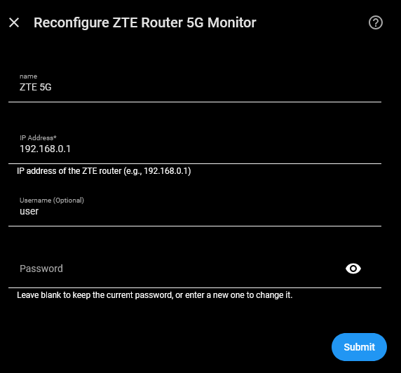

---

</details>

<br>

## 🔩 Under the Hood - Technical Architecture

### 🔄 Data Polling & 3-Strike Resilience

The integration uses a custom `DataUpdateCoordinator` designed for high stability:

<details>

<summary>
&nbsp; &nbsp; ➕ &nbsp; &nbsp; Click to Expand for Details:
</summary><br>

- **Polling Loop**: Fetches everything in as few requests as the router allows — a core batch, a diagnostics batch, and two SMS calls per cycle. The router caps a request by its **length**, not by how many values you ask for, so the readings are split across two batches by how important they are rather than crammed into one.
- **Triggered Refresh**: Changing a setting, deleting SMS, or pressing **Refresh Now** fetches immediately for instant feedback. **Reboot** deliberately does not — the router is on its way down.
- **3-Strike Logic**: To avoid "Unavailable" flickers during momentary router congestion or signal loss:
  1. **First failure** — logs a warning and holds the last known values until the next scheduled poll.
  2. **Second and third failures** — keep holding, logged at debug so a long outage does not flood the log.
  3. **Third failure** — **Integration Health** turns on, one cycle before anything disappears.
  4. **Fourth failure** — entities are marked `Unavailable` and an error is logged.
- **Per-Endpoint Resilience**: The SMS endpoints and the diagnostics batch each carry their **own** strike budget. If one stops responding while the main fetch keeps working, only the entities it feeds are affected — Signal and Data keep updating. In practice you may see a handful of the disabled-by-default diagnostic entities go `Unavailable` on their own; that is the design working, not a fault, and the **Integration Health** sensor names which capability degraded.
- **What is in the main fetch**: everything shown by default — signal, data usage, connection state, SMS counts and the router's identity. Diagnostics, the temperature sensors and the router's own settings ride the second batch, so a problem there can never blank the readings you actually watch.
- **Auto-Recovery**: Once the router is back online, the integration restores all entities automatically.
- **Forced Refresh Always Fetches**: Every explicit action — **Refresh Now**, changing a setting, deleting an SMS — fetches immediately **even while Pause Polling is on**. Only scheduled polls respect the pause.

---

</details>

### 🩺 Self-Diagnosis

Connection failures are visible already: entities go `Unavailable`. The gap this fills is the failure Home Assistant **cannot** see — a poll that _succeeds_ while the data is wrong.

<details>

<summary>
&nbsp; &nbsp; ➕ &nbsp; &nbsp; Click to Expand for Details:
</summary><br>

The **Integration Health** binary sensor (System device) reports:

- **Total outage** — the router unreachable. Flagged on the **first** failure at startup (there are no held values, so waiting would leave you with no explanation), or on the **third** consecutive failure at runtime. A success clears it in the same cycle.
- **Degraded capability** — an optional endpoint that has exhausted its own strike budget.
- **Contract drift** — a successful response containing none of the fields the integration expects, which usually means a firmware update renamed them.

It is deliberately **available at all times**, including when every other entity has gone unavailable — a health sensor that disappears during an outage cannot explain the silence. See the [example automation](#-integration-health-problem-alert).

---

</details>

### 🔨 Repairs

Some problems need you to do something, so they are also raised in Home Assistant's **Repairs** panel rather than only on a sensor. All three clear themselves automatically once the condition passes.

<details>

<summary>
&nbsp; &nbsp; ➕ &nbsp; &nbsp; Click to Expand for Details:
</summary><br>

| Repair                                       | Raised when                                                                                      | Why it is a Repair                                                                                                                                                                      |
| :------------------------------------------- | :----------------------------------------------------------------------------------------------- | :-------------------------------------------------------------------------------------------------------------------------------------------------------------------------------------- |
| **ZTE router is not responding**             | 10 consecutive failed fetches                                                                    | Ten failures in a row means the problem is not clearing on its own. The text lists what to check — power-cycle, whether the IP changed, whether the password changed, the network path. |
| **ZTE router data has changed unexpectedly** | 3 consecutive polls succeed but contain none of the expected fields, having reported them before | Nothing looks broken from the outside, but sensors will be blank. It can follow a firmware update or point to a fault in the integration, so it needs reporting either way.             |
| **ZTE router SMS storage is full**           | The router's message store is at capacity                                                        | New messages will be rejected until some are deleted.                                                                                                                                   |

> [!NOTE]
>
> A brief outage — a router reboot, a passing network glitch — deliberately does **not** raise a Repair. Integration Health turns on after three failed polls and entities go unavailable after four, but the Repairs panel stays quiet until a problem has clearly stopped fixing itself.

---

</details>

### 🔐 Session Handling

The router permits only **one login session at a time**. The integration releases its session when the config entry is unloaded, reloaded or removed, so the router's web UI is available again immediately rather than after the session times out.

<details>

<summary>
&nbsp; &nbsp; ➕ &nbsp; &nbsp; Click to Expand for Details:
</summary><br>

**It also recovers its session automatically.** Because only one session can exist, logging into the router's web UI ends the integration's — and the router signals this by answering normally (`HTTP 200`) with empty values rather than by returning an error. The integration detects that, logs back in and retries the request once, so an action you trigger straight after using the web UI still works. If a request genuinely cannot be completed it **raises an error** rather than returning empty data, so an automation can tell "nothing to report" apart from "could not ask".

---

</details>

### 🆔 Identity & Stable Entities

<details>

<summary>
&nbsp; &nbsp; ➕ &nbsp; &nbsp; Click to Expand for Details:
</summary><br>

- **IMEI-Based Identity**: The integration uses the router's unique hardware IMEI as the primary key. This ensures that even if your router's IP address changes (DHCP), Home Assistant will track the same device and preserve your history and automations.
- **Reconfiguration**: If you change your router's IP or password, use the **Reconfigure** button on the integration card to update settings without losing any data.
- **Data Validation**: Router values are checked against defined guard limits. An out-of-range value (e.g., an impossible signal metric) is rejected and the sensor reads `unknown`, rather than publishing a figure known to be wrong.

---

</details>

### 🔄 Dynamic Polling & Standard System Options

- **Both Available**: The integration provides dynamic polling controls, to pause polling or change polling interval. It also functions normally with the standard Home Assistant **System options** > **Enable polling for changes** toggle.

## ❓ FAQ & Troubleshooting

### 🔌 Connection & Authentication

#### 🔌 **"Failed to connect to router" Error**

<details>

<summary>
&nbsp; &nbsp; ➕ &nbsp; &nbsp; Click to Expand for Details:
</summary><br>

- Verify the IP address is correct.
- Confirm the username and password are correct. The username is optional and varies by model and firmware.
  - The username and password are the same as you use to login to the router via its webUI.
  - Username can be changed in the webUI, as well as password, so ensure you are using the current version of both.
- Ensure the router is powered on and reachable from your Home Assistant instance.

---

</details>

#### 🔒 **Why can't I access the router web UI while this integration is running?**

<details>

<summary>
&nbsp; &nbsp; ➕ &nbsp; &nbsp; Click to Expand for Details:
</summary><br>

- ZTE routers typically only allow **one simultaneous login session**.
- Use the **Pause Polling** switch in Home Assistant to halt polling before you log into the web UI.
- Resume polling when done!
- **Note:** logging into the web UI evicts the integration's session. The integration re-authenticates on its next poll, so this is harmless — but it is also why pausing is the tidier approach.
- Disabling or reloading the integration releases its session immediately, so you do not have to wait for it to time out.

---

</details>

### 📊 Diagnostics & Entity Values

#### ❔ **Some sensors showing "Unknown"**

<details>

<summary>
&nbsp; &nbsp; ➕ &nbsp; &nbsp; Click to Expand for Details:
</summary><br>

- Most sensors showing okay with some unknown **is expected behavior**.
  - The integration fetches everything it can from the router.
  - Not every metric is provided by every ISP or firmware version.
  - 5G NR sensors will show "Unknown" when the router is operating in LTE-only mode.

---

</details>

#### 🔨 **A "Router is not responding" Repair has appeared**

<details>

<summary>
&nbsp; &nbsp; ➕ &nbsp; &nbsp; Click to Expand for Details:
</summary><br>

- This means the integration failed to reach the router **10 times in a row**, so the problem is not resolving on its own. A reboot or a brief glitch will never raise it.
- Work through the checks in the Repair itself, in order: power-cycle the router; check whether its IP address has changed (the Repair names the address currently configured, so you can compare); check whether the router's password was changed; check the network path between Home Assistant and the router.
- If the address or the password has changed, use **Reconfigure** on the integration to update it. A static DHCP reservation for the router prevents the address changing again.
- The Repair clears itself as soon as the router answers.

---

</details>

#### 🛑 **All sensors showing "Unavailable" or "Unknown"**

<details>

<summary>
&nbsp; &nbsp; ➕ &nbsp; &nbsp; Click to Expand for Details:
</summary><br>

- This is normal during a router reboot or if the router is temporarily unreachable.
  - The integration will automatically recover once the connection is restored.
- If sensors do not recover, perform these checks:
  - Ensure you can log into the router's web UI (confirms it is up and the password is correct).
  - Check your Home Assistant logs for specific error messages.
  - Try **⋮ > Reload** on the integration. It re-reads everything and re-applies your settings without removing anything.
  - Delete and re-add the integration only if Reload does not help.

---

</details>

#### 🐛 **How do I download diagnostics?**

<details>

<summary>
&nbsp; &nbsp; ➕ &nbsp; &nbsp; Click to Expand for Details:
</summary><br>

**Settings > Devices & Services > ZTE Router 5G Monitor > ⋮ (three dots) > Download diagnostics.**

This is by far the most useful file to attach to a GitHub issue. Because this integration talks to a family of routers that behave differently from one another, a diagnostics file from _your_ model is often the only way a problem can be understood at all — several fixes have come directly from one.

**It is redacted before it is written**, in four layers. The reason for the care is that `coordinator.data` holds the router's `goform` response **verbatim**, so it carries whatever your firmware chose to return — which includes things you would not expect a bug report to contain.

- **Blanked outright** — the fields with no diagnostic value once removed: your password and username, IMEI, SIM IMSI and ICCID, and your carrier identity (network name, MCC/MNC, APN).
- **Pseudonymized, not blanked** — values worth cross-referencing become stable tokens. IP addresses become `ip-1`, `ip-2`…, cell identifiers become `cell-1`, `cell-2`…, and the same value keeps the same token throughout the file. A maintainer can still see that two fields refer to the same cell, which is often the whole question.
- **Summarized** — an APN profile is reduced to its shape, `<apn profile: 12 fields, 4 set, pdp=IP>`. On some firmware that raw string carries an APN username and password.
- **Swept structurally** — anything IP-shaped or MAC-shaped is tokenized wherever it appears, including inside free text and under keys the integration does not know about. This is the backstop for firmware that returns something unexpected.

**SMS is treated as the most sensitive content in the file, because it is data about someone else.** The message body and the sender's number are removed entirely — not tokenized. What survives is the shape: whether decoding worked, and how long the text was.

**What deliberately stays:** model, firmware and hardware version, every signal metric, bands and channels, byte counters, uptime, the health snapshot and per-endpoint failure counts. Those are the parts that diagnose.

> [!TIP]
>
> If you are reporting a problem on a model other than the MC7010, say so in the issue. Most of this integration's cross-model support is inferred from other open-source projects rather than tested on hardware, so a diagnostics file from an MC888, MC889 or MF-series unit is genuinely valuable even when nothing is wrong.

---

**If setup itself is failing**, there is no config entry yet, so there is nothing to download. Capture a log instead — add this to `configuration.yaml` and restart:

```yaml
logger:
  default: warning
  logs:
    custom_components.zte_router_5g: debug
```

Logs are then visible under **Settings > System > Logs** (click **Load Full Logs**).

> [!IMPORTANT]
>
> **Log files have NO redaction of any kind.** Nothing is stripped or pseudonymized, unlike the diagnostics file above. Review a log before pasting it anywhere.
>
> At `debug` this integration logs status messages, error text and the names of failing endpoints — not response payloads — so your password, session token and the **text** of your SMS messages are not written to it. Two things **can** appear: your **router's host or IP**, because HTTP error messages quote the request URL, and the **sender's number of an incoming SMS**, which is recorded at `info` level and so is present even if you never enable debug logging. The diagnostics file above removes both. Other integrations logging alongside it are another matter entirely.

---

</details>

#### 🔄 **I deleted and re-added the integration for a fresh start - why did my settings and history come back?**

<details>

<summary>
&nbsp; &nbsp; ➕ &nbsp; &nbsp; Click to Expand for Details:
</summary><br>

Because Home Assistant keeps most of it on purpose. This is **Home Assistant behavior, not something this integration controls**, and for most people it's the desirable outcome: re-add the same router and things carry on where they left off, rather than starting from nothing.

| What                                                           | How long Home Assistant keeps it                  | On re-add                               |
| :------------------------------------------------------------- | :------------------------------------------------ | :-------------------------------------- |
| **Long-term statistics** (long-range graphs, Energy dashboard) | Indefinitely - these are never deleted            | Continue unbroken                       |
| **Recent detailed history**                                    | Your recorder retention (10 days by default)      | Continues                               |
| **Entity IDs** (`sensor.…`)                                    | Reused as long as nothing else has taken the name | Dashboards and automations keep working |
| Renames, icons, areas, labels, enabled/disabled state          | **30 days**, in Home Assistant's entity registry  | Restored                                |

The **30 days** applies only to that fourth row - the entity-registry customizations. Statistics aren't on a timer at all, and your entity IDs come back either way. So re-adding after a year still reconnects your graphs; you would just need to redo any renames. Restarting Home Assistant in between makes no difference to any of this.

**If you actually wanted a clean slate**, Home Assistant doesn't really offer one - and in practice you rarely need it. Two supported options exist:

- **Tools > Statistics** lists statistics whose entity no longer exists as _"There is no state available for this entity"_, and lets you delete them individually. Supported, immediate, no restart required.
- The **`recorder.purge_entities`** action drops recent history for entities you name. (It does not touch long-term statistics - use the screen above for those.)

Clearing the retained _entity-registry_ customizations is a different matter: it means hand-editing `.storage/core.entity_registry` with Home Assistant stopped. **Don't.** That single file holds the settings for every entity from every integration you run, and the risk of unintended damage far outweighs re-doing a few renames. Nothing about this integration needs it.

> [!TIP]
>
> If you're re-adding to fix a problem rather than to reset data, try **⋮ > Reload** on the integration first. It re-reads everything and re-applies your settings without removing anything.

One footnote for completeness: an entity ID is reused unless a **different, still-existing** entity has since taken that name, in which case the new one is created as `…_2` and the old statistics stay attached to the original ID. That's uncommon and generally the result of manual renaming elsewhere - it isn't something a normal remove-and-re-add causes.

---

</details>

<br>

## ❗ Known Limitations /❔ What's Missing?

- **Firmware Dependencies**: API feature availability varies by ISP and firmware builds.
- **Non-Bridge-Mode Features**: The integration was developed on and has only been tested with the MC7010 which is an outdoor bridge-mode only device without WiFi. This means the integration does not have:
  - **Client Tracking**: No tracking of connected clients.
  - **WiFi Monitoring**: There are no WiFi features.

## ❌ Removal

To remove the integration from Home Assistant:

<details>

<summary>
&nbsp; &nbsp; ➕ &nbsp; &nbsp; Click to Expand for Details:
</summary><br>

1. Go to **Settings > Devices & Services**.
2. Find the **ZTE Router 5G Monitor** card and click into it.
3. Click the **three dots** (⋮) next to the gear icon and select **Delete**.
4. Confirm deletion.

> [!NOTE]
>
> This integration's entities and devices are removed when the entry is deleted.
>
> Home Assistant keeps your recorded history and entity customizations independently, so re-adding later picks up much where it left off. If that matters to you, see [why settings and history come back](#-i-deleted-and-re-added-the-integration-for-a-fresh-start---why-did-my-settings-and-history-come-back).

---

</details>

<br>

To fully uninstall (HACS):

<details>

<summary>
&nbsp; &nbsp; ➕ &nbsp; &nbsp; Click to Expand for Details:
</summary><br>

1. Go to **HACS**.
2. Find **ZTE Router 5G Monitor** and click into it.
3. Click the **three dots** (⋮) at the top right and select **Remove**.
4. **Restart** Home Assistant.

---

</details>

<br>

## 📝 Maintenance Status

This is a **personal project**. Support and updates are provided on a **"best-effort"** basis only. While I use this integration daily and aim to keep it functional with the latest Home Assistant releases, I cannot guarantee immediate fixes for issues or compatibility with all router firmware versions.

### 📖 Documentation Accuracy

- This README is updated whenever the integration changes, and is intended to describe the current release accurately.
- Two things can put it out of step: a passage this document missed during a revision, or a Home Assistant screen or setting that has been renamed or moved since it was written.
- If you find either, please [open an issue](https://github.com/PlayFaster/ha-zte-router-5g-monitor/issues). It will be corrected.

---

## 🤝 Contributors & Acknowledgements

- 🙏 **[@Kajkac](https://github.com/Kajkac)** ([`ZTE-MC-Home-assistant-repo`](https://github.com/Kajkac/ZTE-MC-Home-assistant-repo)): Special thanks for pioneering the early Home Assistant integration for ZTE MC-series routers, which provided the foundational basis for this project.

- 🙏 **[@william-aqn](https://github.com/william-aqn)** ([`huawei_lte_extended`](https://github.com/william-aqn/huawei_lte_extended)): The approach to expanded SMS service functionality, bus events, and inbox management is based on this work.

- 🙏 **[Miononno](https://miononno.it/)**: Foundational community reverse-engineer whose browser inspector scripts and parameter mappings (`goformId` values, Z5g_rsrp and related signal keys, and the AD token derivation md5(md5(wa_inner_version + cr_version) + RD)) opened up the ZTE `goform` interface for the MC-series 5G CPEs.

- 🙏 **[@rosenrot00](https://github.com/rosenrot00)** ([`ha-zte-ng-router`](https://github.com/rosenrot00/ha-zte-ng-router)) & **[@juacas](https://github.com/juacas)** ([`zte_tracker`](https://github.com/juacas/zte_tracker)): For insights into ZTE's `ubus` JSON-RPC and Lua/XML API architectures across broader ZTE router families.

- 🤖 This project was developed with the assistance of AI to ensure code quality and adherence to best practices.

---

## 🔀 Other Options

This integration is specifically optimized as a high-performance, async-native monitor for ZTE 5G CPEs (primarily the **MC7010**, as well as the MC801, MC888, MC889, MF266, MF286 and MF289 family series).

If ZTE Router 5G Monitor does not work for your specific router model or deployment setup, several excellent alternative Home Assistant integrations exist depending on your hardware type:

- 📶 **[`Kajkac/ZTE-MC-Home-assistant-repo`](https://github.com/Kajkac/ZTE-MC-Home-assistant-repo)** by @Kajkac  
  _Best for:_ ZTE MC801A, MC888, MC889, and G5 Ultra routers. Provides broad signal telemetry, data usage, SMS, and Wi-Fi/LAN device tracking.

- ⚡ **[`rosenrot00/ha-zte-ng-router`](https://github.com/rosenrot00/ha-zte-ng-router)** by @rosenrot00  
  _Best for:_ ZTE Next-Gen (NG) 5G CPEs (G5TC, G5TS, G5C, G5 Max). Connects via ZTE's OpenWrt-derived `/ubus/` JSON-RPC API backend.

- 🏠 **[`juacas/zte_tracker`](https://github.com/juacas/zte_tracker)** by @juacas  
  _Best for:_ ZTE Landline Broadband / Fiber ONTs and Mesh Routers (F6640, F6645P, F680, F6600P, H288A, H388X, E2631, etc.). Specialized in Wi-Fi/LAN device tracking and mesh node topology discovery (`topo_lua.lua`).

- 🌐 **[`AldenDana/ha-zte-fibra`](https://github.com/AldenDana/ha-zte-fibra)** by @AldenDana  
  _Best for:_ ISP-provided ZTE Fiber ONTs such as the ZTE FIBRA6S (Orange Spain Livebox 6s). Focuses on device tracking via ZTE's `hiddenData` Lua API.

---

## 📄 License

[](https://opensource.org/licenses/Apache-2.0)

This project is licensed under the Apache License, Version 2.0. See [LICENSE](LICENSE) for details.

---

💬 **Questions or Issues?** Visit the [GitHub repository](https://github.com/PlayFaster/ha-zte-router-5g-monitor).
