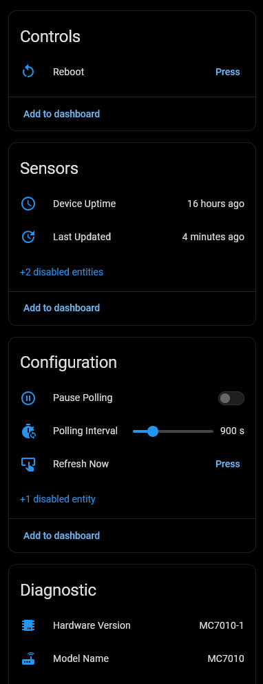
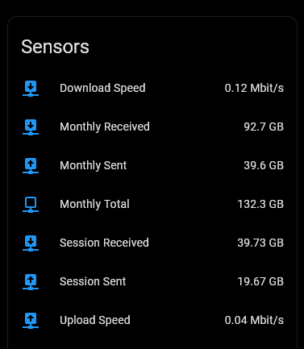

# ZTE Router 5G Monitor for Home Assistant

       

Home Assistant integration for ZTE MC7010 5G Router that provides detailed signal statistics, data usage tracking, and SMS management.

## Supported Models

- **ZTE MC7010** – 5G Outdoor CPE. This works with, and has only been tested with, ZTE MC7010. It may work with other similar ZTE devices.

## ✅ Features

- **Signal Monitoring**: Real-time RSRP, RSRQ, RSSI, and SNR for both LTE and 5G.
- **Data Tracking**: Monthly download, upload, and total usage.
- **SMS Management**: View recent messages and delete the mailbox directly from HA.
- **Categorized Devices**: Separate devices for Router Stats, Data Usage, Signal Monitoring and SMS Services.
- **Resilient Polling**: Includes a hybrid retry logic (30s retry) and stale-data grace periods to prevent "Unavailable" flickers during router reboots.

- **Pause Polling**: Switch to allow uninterrupted access to the router webui if needed (zte only allow a single login).

## 📸 Screenshots

### Integration Overview

### Signal & Controls

### Data Usage

### SMS Management

## ✨ Installation

### HACS (Recommended)

1. Add this repository as a **Custom Repository** in HACS:
   - Open HACS in Home Assistant
   - Click **Custom repositories** (⋮ menu)
   - Add repository URL and Type: `Integration`
2. Search for "ZTE Router 5G Monitor" and click **Download**
3. Restart Home Assistant
4. Go to **Settings > Devices & Services > Add Integration** and search for "ZTE Router 5G Monitor"

### Manual Installation

1. Download the repository
2. Copy the `custom_components/zte_router_5g` folder to your Home Assistant `custom_components` directory
3. Restart Home Assistant
4. Go to **Settings > Devices & Services > Add Integration** and search for "ZTE Router 5G Monitor"

## Configuration

Setup is handled entirely via the UI. You will need:

- Router IP Address (e.g., 192.168.0.1)
- Router Username
- Admin Password

## 🗑️ Removal

To remove the integration from Home Assistant:

1. Go to **Settings > Devices & Services**.
2. Find the **ZTE Router 5G Monitor** card.
3. Click the **three dots** (⋮) and select **Delete**.
4. Confirm deletion.

To fully uninstall (HACS):

1. Go to **HACS > Integrations**.
2. Find **ZTE Router 5G Monitor**.
3. Click the **three dots** (⋮) and select **Remove**.
4. Restart Home Assistant.

## 📝 Maintenance Status

This is a **personal project**. Support and updates are provided on a **"best-effort"** basis only. While I use this integration daily and aim to keep it functional with the latest Home Assistant releases, I cannot guarantee immediate fixes for issues or compatibility with all router firmware versions.

## 🤝 Contributors & Acknowledgements

- 🙏 Special Thanks: This project is based on the original work done by @Kajkac on ZTE Routers. A big thanks for the heavy lifting!
- This project was developed with the assistance of AI to ensure code quality and adherence to best practices.

## 📄 License 

This project uses the Apache License, Version 2.0, for more details see the [license](LICENSE) document.

---

**For issues, feature requests, or contributions, please visit the [GitHub repository](https://github.com/PlayFaster/ha-zte-router-5g-monitor).**
